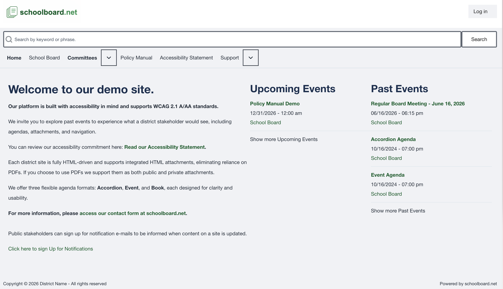

<!-- fullWidth: false tocVisible: false tableWrap: true -->
<!-- fullWidth: false tocVisible: false tableWrap: true -->

# Welcome to schoolboard.net

## Quick Summary

schoolboard.net helps districts create, publish, search, and manage board meeting materials.

It is designed to help districts publish materials that are easier to read, easier to search, and easier for people with disabilities to use.

## What This Documentation Does

This documentation teaches you how to use schoolboard.net.

It also teaches you how to make board materials more accessible.

That is important because public meeting materials should work for everyone.

## What Makes schoolboard.net Different

Many board agenda systems depend heavily on PDF files.

PDF files can be useful. But they can also be hard for screen readers, mobile phones, search tools, and long-term records systems.

schoolboard.net encourages districts to use accessible web content whenever possible.

That means important agenda information can be shown as clean HTML instead of only being locked inside a file.

## Who Uses schoolboard.net

Common users include:

- District Administrators
- Board Clerks
- Administrative Assistants
- Board Members
- Group Administrators
- Staff who prepare agenda items
- Members of the public who view published agendas

## What You Will Learn

This documentation will help you learn how to:

- Sign in.
- Manage users.
- Create groups.
- Add people to groups.
- Create accordion agendas.
- Add agenda sections and agenda items.
- Add accessible HTML content.
- Upload public and private files.
- Publish agendas.
- Send notifications.
- Use revisions.
- Search records.
- Print or export meeting materials.

## Good to Know

You do not need to be a programmer to use schoolboard.net.

Most tasks are normal office tasks.

If you can use email, Microsoft Word, and a web browser, you can learn schoolboard.net.

## Accessibility Note

Accessible documents help everyone.

They help people who use screen readers. They also help people using phones, tablets, older computers, or slow internet connections.

## The schoolboard.net Home Page

The schoolboard.net home page is the public entry point to your district's board meeting information.

Visitors can:

- Search for agendas, meetings, and policies.
- View upcoming and past meetings.
- Access the Accessibility Statement.
- Navigate to committee pages and policy manuals.
- Sign up for notifications (if enabled).

*Figure GS-001. The schoolboard.net home page displayed using the standard documentation capture profile.*

## Related Topics

- [What is schoolboard.net?](what-is-schoolboardnet.md)
- [Accessibility First](accessibility-first.md)
- [Core Concepts](core-concepts.md)

---

## Revision History

| Version | Date       | Author              | Description    |
| ------- | ---------- | ------------------- | -------------- |
| 0.2.1   | 2026-07-03 | schoolboardnet, LLC | Initial draft. |
