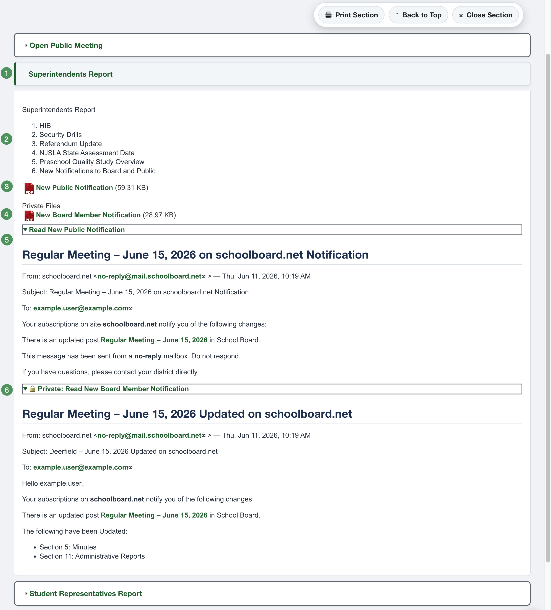
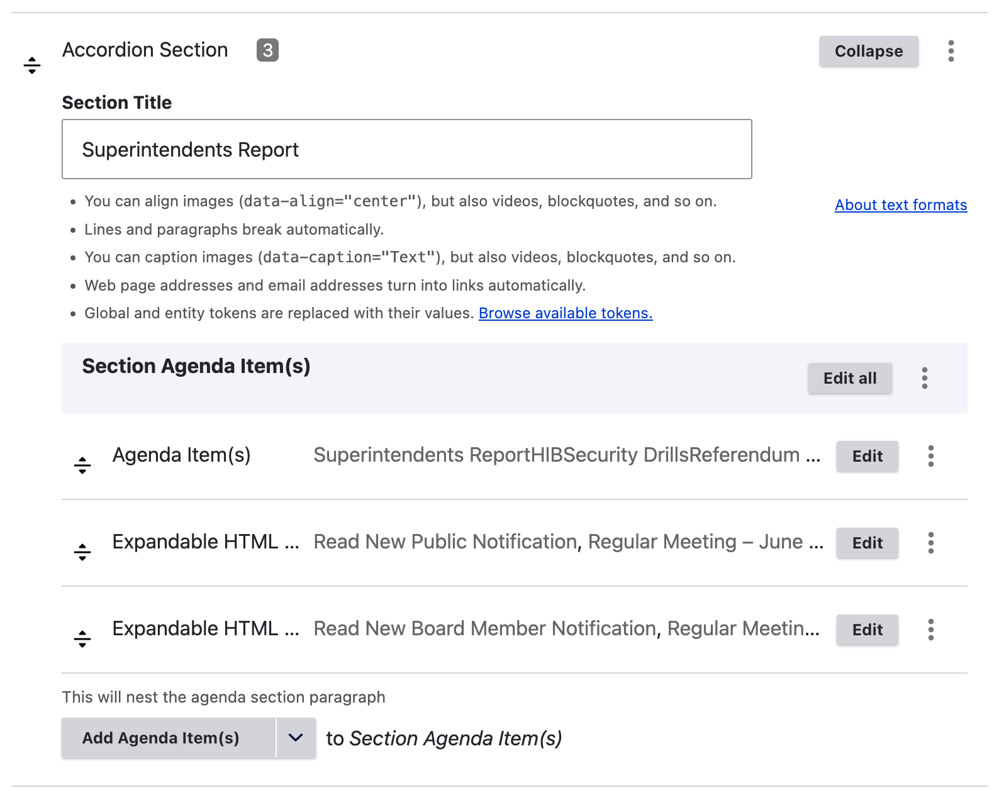

# Anatomy of an Accordion Agenda

An Accordion Agenda is built from nested components. Understanding their relationship makes editing and troubleshooting much easier.

{ .doc-screenshot }

*Figure SB-AAC-014. Anatomy of a completed Accordion Agenda section.*

## Accordion Section

An **Accordion Section** is an agenda heading, such as Finance, Superintendent, Public Comment, or Executive Session. Build the agenda one section at a time.

{ .doc-screenshot }

*Figure SB-AAC-015. A saved Accordion Section.*

## Agenda Item

An **Agenda Item** belongs inside an Accordion Section. Use it for the actual matter under consideration, such as a report, discussion item, motion, resolution, presentation, or approval.

## Expandable HTML

Expandable HTML provides an accessible on-page alternative to relying only on a PDF.

- **Read text** becomes the button or link label.
- **HTML** contains the accessible document content.
- Public expandable HTML is available to every visitor.
- Private expandable HTML is visible only to authorized group members.

Use a descriptive label such as **Read Superintendent's Report**. For confidential content, use a clearly marked label such as **Private: Read Executive Session Materials**.

## Public and private files

- **Public files** are visible to everyone after publication.
- **Private files** are visible only to authorized, signed-in group members.

!!! warning "Verify confidential material"
    Before publication, confirm that every confidential file and expandable item is beneath the correct private heading. Preview is an administrator view and cannot prove what an anonymous visitor will see.

## Component hierarchy

```text
Accordion Agenda
└── Accordion Section
    └── Agenda Item
        ├── Public File
        ├── Private File
        ├── Public Expandable HTML
        └── Private Expandable HTML
```
