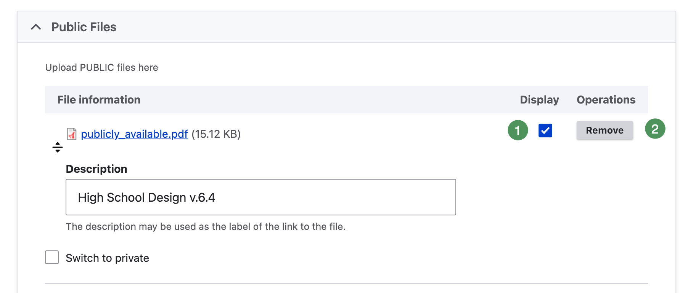

# Add and Organize Attachments

Attachments belong beneath the Agenda Item they support.

## Understand attachment access

- **Public Files** are available to everyone after publication.
- **Private Files** are available only to authorized, signed-in Group members.

{ .doc-screenshot }

*Figure SB-AAC-014. Public and private components beneath an Agenda Item.*

### Numbered components

1. **Accordion Section**
2. **Agenda Item**
3. **Public File**
4. **Private File**
5. **Public Expandable HTML**
6. **Private Expandable HTML**

## Add a public attachment

1. Edit the appropriate Agenda Item.
2. Expand **Public Files**.
3. Select **Choose Files** and choose the approved file.
4. Enter a meaningful **Description** that can serve as the link label.
5. Leave **Display** selected when the attachment should appear.
6. Save in Draft Mode.

## Add a private attachment

1. Edit the appropriate Agenda Item.
2. Expand **Private Files**.
3. Select **Choose Files** and choose the confidential file.
4. Enter a meaningful description.
5. Save in Draft Mode.

!!! important "Verify Group assignment"
    Private access depends on the agenda's Group assignment. Actively select the intended Group after cloning and confirm it before publication.

## Display or hide an attachment

{ .doc-screenshot }

*Figure SB-AAC-018A. Existing attachment controls.*

1. **Display** — selected when the attachment should appear.
2. **Remove** — removes the attachment when the agenda is saved.

Do not use Display as a privacy control; public or private placement controls access.

## Reorder attachments

Use the drag handle beside a file to change its order. Keep related files together and order them as they are discussed in the Agenda Item. Save and review the result.

## Related topics

- [Replace attachments or change access](attachments-replace-access.md)
- [Accordion Sections and Agenda Items](sections-agenda-items.md)
- [Final Publication Checklist](publication-checklist.md)
