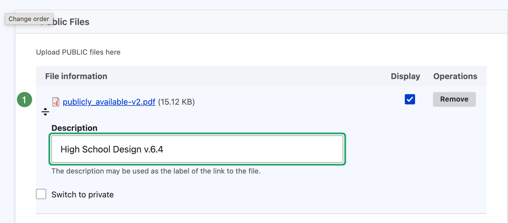

# Replace Attachments or Change Access

Use these procedures to correct an attachment without rebuilding its Agenda Item.

## Replace an attachment safely

Use a **new filename** for the replacement so browsers and search indexes recognize it as a new version.

1. Edit the Agenda Item containing the old file.
2. Select **Remove** beside the old attachment.
3. Upload the approved replacement in the same public or private area.
4. Give it a new filename, such as `high-school-design-v2.pdf`.
5. Confirm its description and Display setting.
6. Save in Draft Mode.
7. Reopen and test the replacement.

{ .doc-screenshot }

*Figure SB-AAC-018B. Use a new filename and meaningful description.*

!!! warning "Open the replacement"
    Confirm that the saved file is the approved version, opens correctly, and remains under the intended Agenda Item and access level.

## Move a file between public and private

{ .doc-screenshot }

*Figure SB-AAC-019. Move an attachment when the agenda is saved.*

1. **Switch to private** moves a public attachment into Private Files.
2. **Switch to public** moves a private attachment into Public Files.

### Move public to private

1. Select **Switch to private** beside the public file.
2. Save.
3. Reopen the Agenda Item and confirm the file appears under Private Files.

### Move private to public

1. Confirm approval for public release.
2. Select **Switch to public** beside the private file.
3. Save.
4. Reopen the item and confirm the file appears under Public Files.
5. Verify it from the signed-out public view after publication.

!!! warning "Public release requires deliberate review"
    Switch to public changes who may access the file. Confirm authorization and contents before selecting it.

## Correction checklist

- [ ] The old file was removed when replacing it.
- [ ] The replacement uses a new filename.
- [ ] Its description and Display setting are correct.
- [ ] It opens successfully after saving.
- [ ] It belongs to the intended Agenda Item.
- [ ] Its public or private access is correct.

## Related topics

- [Add and organize attachments](attachments-add-organize.md)
- [Troubleshoot attachment problems](troubleshooting-attachments.md)
- [Final Publication Checklist](publication-checklist.md)
