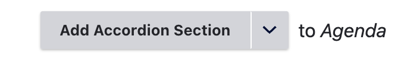
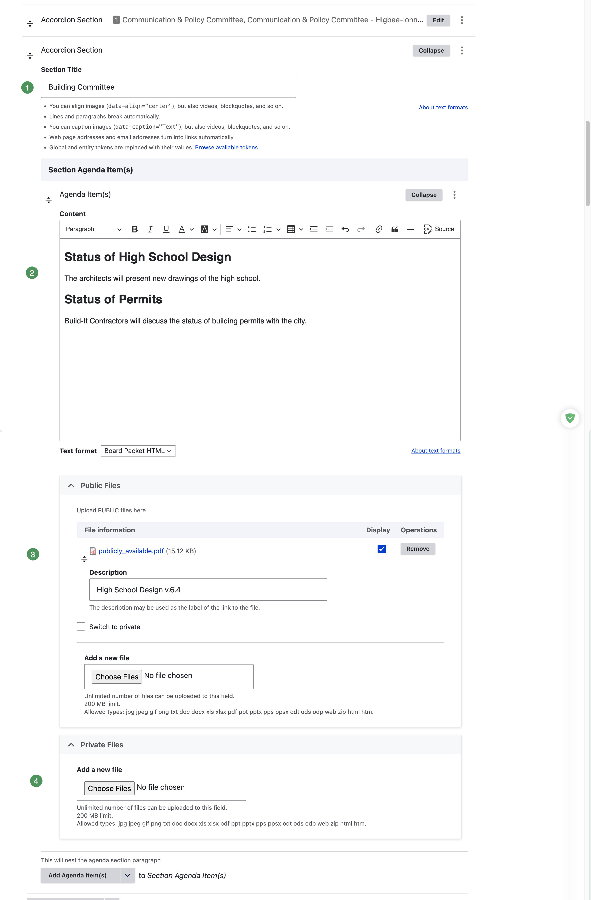
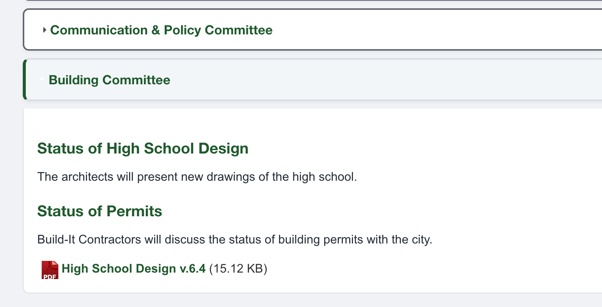
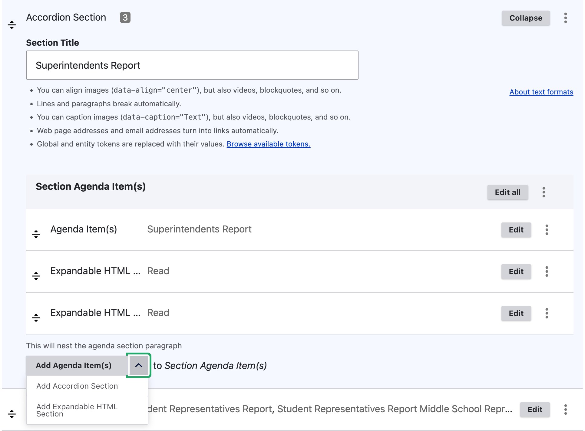
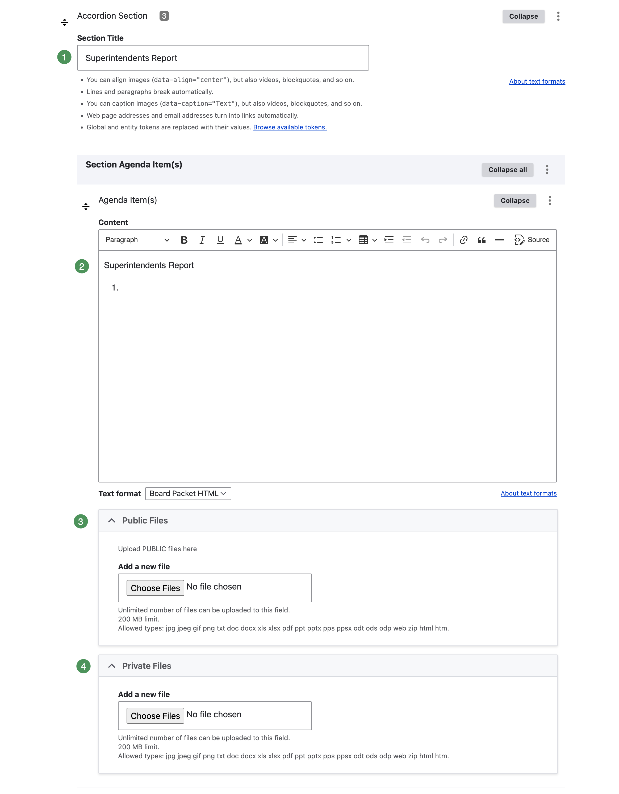

# Building and Editing an Accordion Agenda

Build an agenda one **Accordion Section** at a time. Each section contains one or more **Agenda Items**, and each Agenda Item may contain public or private files and public or private Expandable HTML.

Keep the agenda in [Draft Mode](draft-mode.md) throughout this work so you can save and review changes safely.

## Add an Accordion Section

1. Open the agenda for editing.
2. Go to the location where the new section should appear.
3. Select **Add Accordion Section**.

{ .doc-screenshot }

*Figure SB-AAC-011A. Add an Accordion Section to the agenda.*

4. Enter a concise **Section Title**, such as **Building Committee**, **Public Comment**, or **Superintendent's Report**.
5. Add the Agenda Item content that belongs beneath the heading.
6. Add public or private supporting material when needed.

{ .doc-screenshot }

*Figure SB-AAC-011B. Complete the new Accordion Section.*

### Numbered section fields

1. **Section Title** — the heading visitors select to expand or collapse this part of the agenda.
2. **Agenda Item content** — the matters, reports, motions, resolutions, or discussion text within the section.
3. **Public Files** — attachments available to everyone after publication.
4. **Private Files** — attachments available only to authorized, signed-in Group members.

After saving, the new section appears in the agenda as a collapsible heading.

{ .doc-screenshot }

*Figure SB-AAC-011C. A saved Accordion Section in the agenda.*

!!! tip "Use clear section titles"
    Readers scan section headings to find information quickly. Use familiar, specific titles and apply the district's approved naming consistently from meeting to meeting.

## Edit an Accordion Section and its Agenda Items

Select **Edit** beside the section. The expanded editor displays the section title and every nested Agenda Item.

{ .doc-screenshot }

*Figure SB-AAC-003. Edit the section and add nested content.*

The **Add Agenda Item(s)** menu lets you add:

- an **Agenda Item** for meeting text and its supporting materials;
- an **Expandable HTML Section** for accessible content that opens on the page; or
- another component offered by the approved site configuration.

An Agenda Item may contain more than one heading or paragraph when those entries belong to the same matter. Create a separate Agenda Item when the material needs its own attachments or should be managed independently.

{ .doc-screenshot }

*Figure SB-AAC-004. Edit an Agenda Item and its supporting files.*

### Numbered Agenda Item fields

1. **Section Title** — identifies the parent Accordion Section.
2. **Content** — contains the Agenda Item headings, descriptions, motions, resolutions, reports, or discussion text.
3. **Public Files** — attachments available to everyone after publication.
4. **Private Files** — attachments restricted to authorized Group members.

Keep **Text format** set to the district's approved format unless schoolboard.net Support directs otherwise.

!!! important "Files belong to the Agenda Item"
    Public Files, Private Files, Public Expandable HTML, and Private Expandable HTML belong beneath an **Agenda Item**. Verify that supporting material is nested under the intended Agenda Item before saving.

## Add Expandable HTML

Expandable HTML places accessible document content directly on the agenda page. Whenever practical, use it to provide an accessible alternative to information otherwise available only in a file.

1. Open the parent Accordion Section for editing.
2. Open the arrow beside **Add Agenda Item(s)**.
3. Select **Add Expandable HTML Section**.
4. Complete the fields and save the agenda in Draft Mode.

{ .doc-screenshot }

*Figure SB-AAC-005. Configure an Expandable HTML item.*

### Numbered Expandable HTML controls

1. **Reorder handle** — drag the item to a different position within its parent Agenda Item.
2. **Private** — restricts the Expandable HTML to authorized, signed-in Group members.
3. **Expand Text** — the link or button label visitors select, such as **Read Superintendent's Report**.
4. **HTML Content** — the accessible information displayed when the item is expanded.
5. **Editor toolbar** — formats the content; use **Source** only when you are authorized and comfortable editing HTML.
6. **Collapse** — closes the editor without removing the item.
7. **Actions menu** — provides **Remove** and **Duplicate** commands.

The optional **Section Heading** can identify the content above the Expand Text. Use **Anchor ID** only when the page needs a direct link to that item; do not include spaces, periods, or other punctuation.

### Public and private Expandable HTML

- Leave **Private** unchecked for information intended for everyone.
- Select **Private** only for content intended for authorized Group members.
- Use a clear private label, such as **Private: Read Executive Session Materials**, to help administrators recognize confidential content during review.

!!! warning "Private content requires a final check"
    Before publishing, verify both the **Private** checkbox and the item's position. Preview is an administrator view and is not a reliable test of what an anonymous visitor can see.

## Reorder Accordion Sections

Use the drag handle on the left side of a section to change its position.

1. Select and hold the section's drag handle.
2. Drag the section to the desired location.
3. Release it when the destination is highlighted.
4. Save the agenda.

{ .doc-screenshot }

*Figure SB-AAC-012A. Select the section's drag handle.*

{ .doc-screenshot }

*Figure SB-AAC-012B. Move the section and save the new order.*

Reordering changes only the current agenda. It does not change the master template from which the agenda was cloned.

## Duplicate or remove a section

Open the three-dot actions menu beside an Accordion Section.

{ .doc-screenshot }

*Figure SB-AAC-013. Section actions.*

1. **Remove** — deletes the section, its nested content, and every attachment in that section.
2. **Duplicate** — copies the entire section, including every attachment in that section.

!!! warning "Remove attachments before removing a section"
    Although **Remove** deletes the section and all of its attachments, the recommended procedure is to remove the attachments first and then remove the section. Confirm that every attachment and the section itself are the intended targets before saving.

!!! warning "Do not duplicate attachments"
    **Duplicate** copies all attachments in the section. Duplicating attachments is not recommended and may create obsolete or unintended copies. Do not duplicate a populated section merely to reuse its structure. Create a new section instead, or duplicate only an attachment-free section after confirming that none of its nested content contains files.

## Review the saved result

After saving, open the draft and expand each changed section. Confirm:

- section titles and order are correct;
- Agenda Item text is complete;
- each supporting item belongs to the intended Agenda Item;
- public and private content is classified correctly;
- duplicated material has been renamed and updated; and
- the agenda remains **Private**, **Notifications unchecked**, and **Published unchecked** until final review is complete.

{ .doc-screenshot }

*Figure SB-AAC-014. Review the saved section in the draft agenda.*

## Related topics

- [Anatomy of an Accordion Agenda](anatomy.md)
- [Work safely in Draft Mode](draft-mode.md)
- [Templates and cloning](templates-cloning.md)
