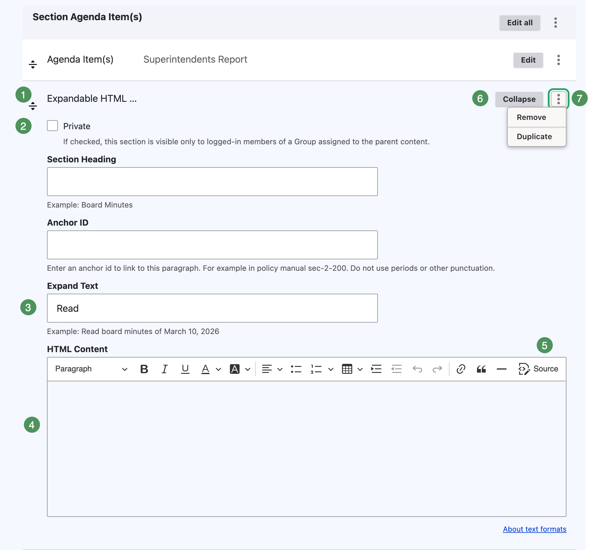
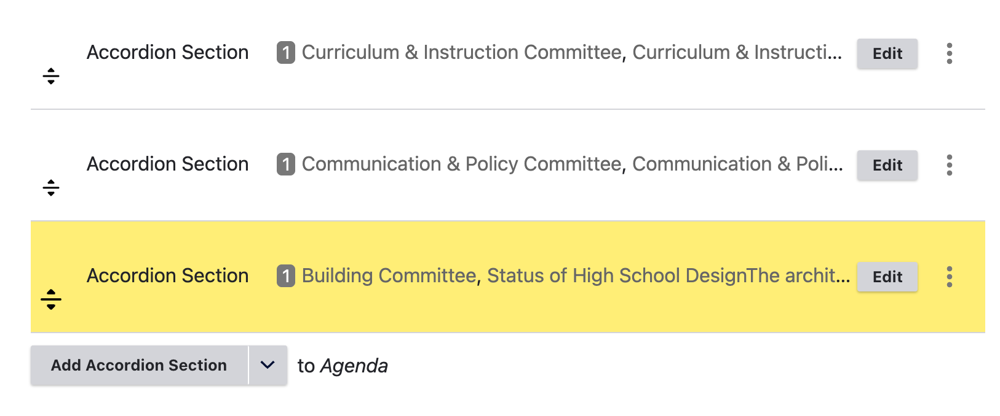
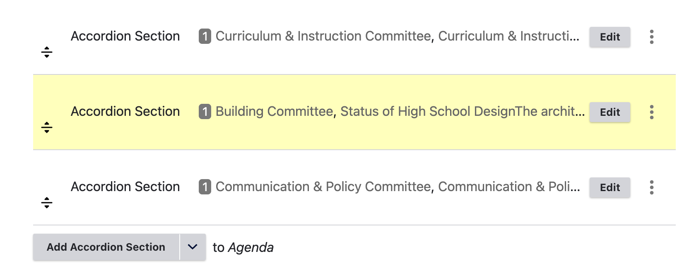
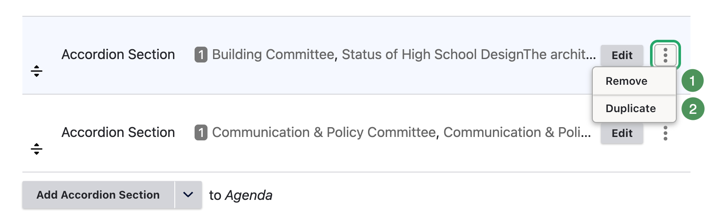
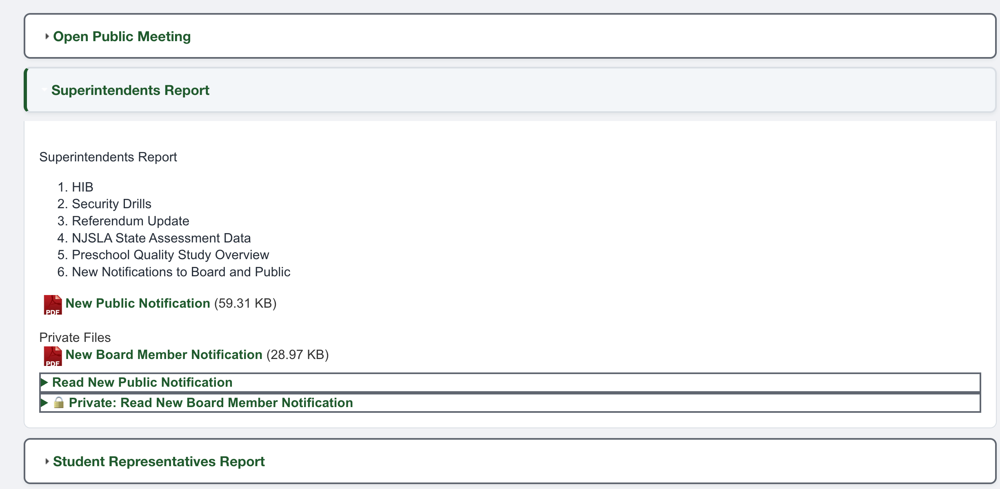

# Expandable HTML and Section Controls

Expandable HTML places accessible document content directly on the agenda page. Whenever practical, use it to provide an accessible alternative to information otherwise available only in a file.

## Add Expandable HTML

1. Open the parent Accordion Section for editing.
2. Open the arrow beside **Add Agenda Item(s)**.
3. Select **Add Expandable HTML Section**.
4. Complete the fields and save in Draft Mode.

{ .doc-screenshot }

*Figure SB-AAC-005. Configure an Expandable HTML item.*

### Numbered controls

1. **Reorder handle** — moves the item within its parent Agenda Item.
2. **Private** — restricts the item to authorized Group members.
3. **Expand Text** — the link label, such as **Read Superintendent's Report**.
4. **HTML Content** — the accessible information displayed when expanded.
5. **Editor toolbar** — formats content; use **Source** only when authorized to edit HTML.
6. **Collapse** — closes the editor without removing the item.
7. **Actions menu** — provides **Remove** and **Duplicate**.

Use the optional **Section Heading** when the content needs a heading above the Expand Text. Use **Anchor ID** only for a direct link and do not include spaces, periods, or other punctuation.

## Public and private Expandable HTML

- Leave **Private** unchecked for information intended for everyone.
- Select **Private** for content intended only for authorized Group members.
- Use a clear private label such as **Private: Read Executive Session Materials**.

!!! warning "Verify private content"
    Before publishing, verify both the Private checkbox and the item's position. Preview is an administrator view and cannot prove what an anonymous visitor sees.

## Reorder Accordion Sections

1. Select and hold the section's drag handle.
2. Drag the section to the desired location.
3. Release it when the destination is highlighted.
4. Save.

{ .doc-screenshot }

*Figure SB-AAC-012A. Select the drag handle.*

{ .doc-screenshot }

*Figure SB-AAC-012B. Move the section and save the order.*

Reordering changes only the current agenda, not its master template.

## Duplicate or remove a section

{ .doc-screenshot }

*Figure SB-AAC-013. Section actions.*

1. **Remove** deletes the section, nested content, and all its attachments.
2. **Duplicate** copies the entire section, including all attachments.

!!! warning "Remove attachments first"
    Remove attachments before removing a section. Confirm every target before saving.

!!! warning "Do not duplicate attachments"
    Do not duplicate a populated section merely to reuse its structure. Create a new section, or duplicate only a confirmed attachment-free section.

## Review the saved result

Confirm titles, content, order, privacy, and removal of obsolete or duplicated material.

{ .doc-screenshot }

*Figure SB-AAC-014. Review the saved section.*

## Related topics

- [Accordion Sections and Agenda Items](sections-agenda-items.md)
- [Public and private attachments](attachments-add-organize.md)
- [Draft Mode](draft-mode.md)
- [Accessible Content Authoring Guide](https://docs.schoolboard.net/authoring/)
- [Remove Word and Google Docs formatting junk](https://docs.schoolboard.net/authoring/formatting-cleanup/)
