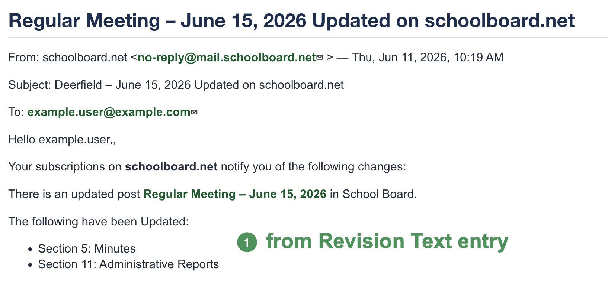

# Notifications and Revisions

Use revisions to preserve a change record and explain updates after publication.

## Revise a published agenda

1. Open the current published agenda for editing.
2. Make the approved changes.
3. Select **Create new revision**.
4. Enter meaningful **Revision Text**.
5. Confirm visibility, notification audience, publication, and Group.
6. Save.
7. Reopen and verify the newest revision.

Good Revision Text is brief and specific:

- **Section 5: Minutes updated**
- **Section 11: Administrative Reports added**
- **Building Committee attachment replaced**

Avoid vague entries such as **updated** or **changes**.

{ .doc-screenshot }

*Figure SB-AAC-007. Revision Text tells Group members what changed.*

The numbered callout identifies the Revision Text included in the Group-member notification.

!!! tip "Use the newest revision"
    When several entries share a title, use the Updated date and time to select the most recent revision. Do not delete older entries until the current published version is confirmed.

## Notify Group members without notifying the public

1. Edit the agenda and make the approved change.
2. Create a new revision and enter meaningful Revision Text.
3. Set **Visibility** to **Private**.
4. Select **Notifications** and save to notify Group members.
5. Reopen the agenda.
6. Restore **Visibility** to **Public**.
7. Leave **Notifications** unchecked and save again.
8. Sign out and verify that the agenda is public.

!!! warning "Do not leave the agenda Private"
    Complete the second save that restores Public visibility, then verify the signed-out view.

## Revision checklist

- [ ] The newest revision was edited and reviewed.
- [ ] Revision Text explains the change.
- [ ] Notifications were selected only for the intended audience and save.
- [ ] Final Visibility is Public when the agenda should be public.
- [ ] Published remains selected.
- [ ] The signed-out agenda works correctly.

## Related topics

- [Publish and verify](publish-verify.md)
- [Troubleshoot notifications and revisions](troubleshooting-notifications.md)
