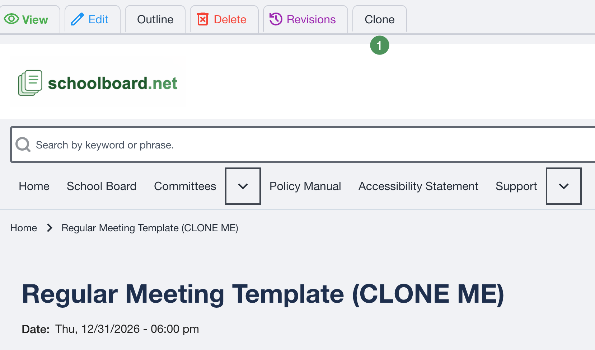
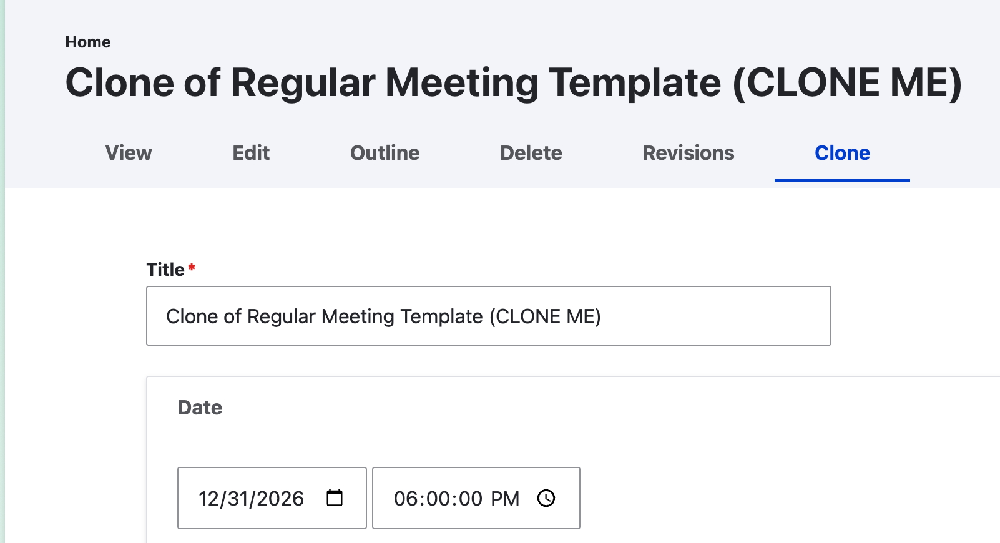

# Templates and Cloning

Most districts maintain a separate master template for each recurring meeting type. Templates preserve the district's approved structure and dramatically reduce preparation time.

## Common templates

- Regular Board Meeting
- Regular Board Meeting with Closed Session
- Work Session
- Special Meeting
- Budget Workshop
- Organizational Meeting
- Committee Meeting

{ .doc-screenshot }

*Figure SB-AAC-002. A reusable master template may contain recurring sections, agenda items, and expandable HTML.*

## Find the correct template

Open **Drafts & Templates** from the group home page. The list sorts by meeting date in reverse order, newest first.

- Current drafts appear near the top.
- Give permanent templates an intentionally older date so they remain near the bottom.
- Select **Show More** when a template is not immediately visible.

{ .doc-screenshot }

*Figure SB-AAC-010. Select Show More to display older templates.*

## Clone the template

1. Open the approved template for the meeting type.
2. Select **Clone** from the top menu.

{ .doc-screenshot }

*Figure SB-AAC-008. Select Clone from the template's top menu.*

3. Replace the **Clone of...** title with the correct meeting title.
4. Update the date, time, agenda header, and placeholder text.
5. Click the correct **Group**, even if it already appears highlighted.
6. Confirm Draft Mode settings.
7. Save. The independent agenda appears in **Drafts & Templates**.

{ .doc-screenshot }

*Figure SB-AAC-009. Update the clone and actively select its Group.*

!!! important "A highlighted Group may not be selected"
    Always click the destination Group before saving. An unassigned agenda can appear to be missing, fail to display on the expected group page, and notify the wrong audience or no audience.

## Protect master templates

- Limit structural template changes to designated administrators.
- Never convert the master template into a current meeting agenda.
- Change a template only when the district intentionally changes its standard format.
- Maintain distinct templates for meeting types with different structures.
- Add reusable blank expandable HTML blocks when they reduce repetitive work.

!!! tip "Need a new template?"
    Send schoolboard.net Support an approved outline, Word document, or sample agenda. The “magical elves” can build a reusable template, often providing the quickest way to learn the system and establish a consistent starting point.
