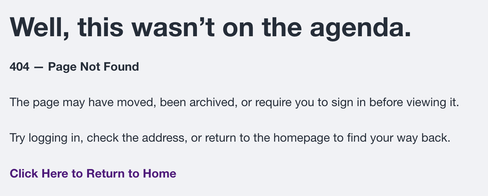

# Find Content and Resolve Access

## I cannot find an agenda

1. Check **Drafts & Templates**.
2. Select **Show More**.
3. Remember the list sorts by meeting date, newest first.
4. Verify the Group.
5. Ask a District Administrator to search the administrative **Content** list.
6. Verify Group assignment and publication status.

When revisions share a title, select the entry with the newest Updated date and time.

!!! warning "Do not recreate it immediately"
    Confirm the original does not exist before creating another agenda.

## A template is missing

- Select Show More.
- Look near the bottom because templates often use intentionally older dates.
- Confirm the Group.
- Ask the designated template administrator before replacing it.

## The cloned agenda is missing from its Group

1. Ask a District Administrator to locate it in Content.
2. Edit it and actively select the correct Group.
3. Save in Draft Mode.
4. Confirm it appears on the Group home page.

## The public cannot see the agenda

Confirm Public visibility, Published, the correct public Group, and a successful save. Then sign out and test the public page.

!!! warning "After a Group-only notification"
    Restore Public visibility with Notifications unchecked, save, and verify the signed-out view.

## Members cannot see private material

Confirm the correct Group assignment, current membership, private placement, and that the user signed in with the correct account.

## A 403 — Access Denied message appears

A 403 message means the content exists, but the current account does not have permission to view it.

{ .doc-screenshot }

Confirm the signed-in account, Group membership, content Group assignment, and whether the item is Public or Private. A District Administrator should review access when an authorized user still receives the message.

## A 404 — Page Not Found message appears

A 404 message means the address does not currently lead to an available page. The agenda may have moved, been archived, become unpublished, use an outdated link, or have an incorrect Group assignment.

{ .doc-screenshot }

Return to the Group page, locate the agenda again, and verify the current link. If it is still missing, ask a District Administrator to search **Content**, choose the newest revision, and verify Group assignment, visibility, and publication status. Do not recreate the agenda until the original has been located or confirmed missing.

## Related topics

- [Troubleshooting overview](troubleshooting.md)
- [Templates and cloning](templates-cloning.md)
- [Publish and verify](publish-verify.md)
