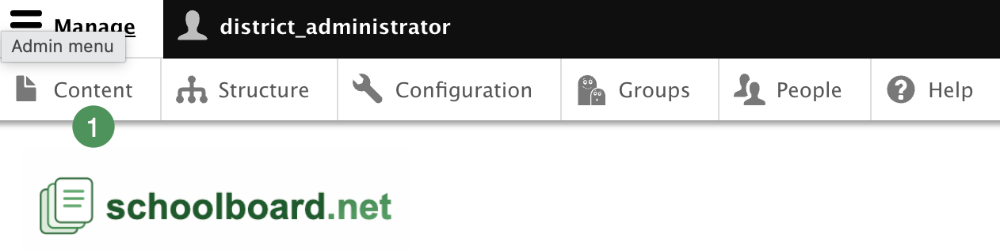
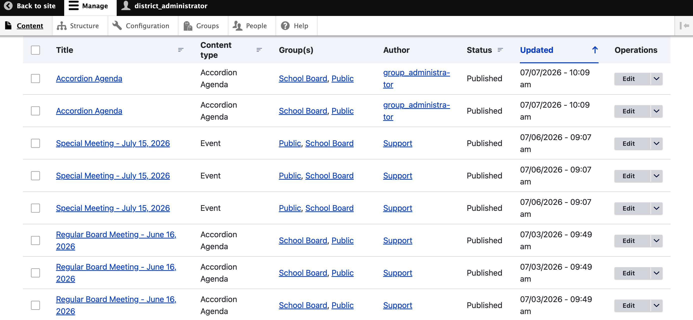

# Find Missing Content or Agendas

District Administrators can use **Content** to search the complete site-wide content list, including items that do not appear on the expected group page.

## Search the Content list

1. Select **Manage**, then **Content**.

{ .doc-screenshot }

*Figure SB-DST-023. Open the site-wide Content list.*

2. Search by title or part of the title.
3. Filter by content type or publication status when useful.
4. Sort by **Updated**, or scroll through the list.
5. Review the assigned **Group**, author, status, and updated date before opening the item.

{ .doc-screenshot }

*Figure SB-DST-024. Search all site content and compare revisions.*

Before recreating an agenda, always check the Content list to determine whether it already exists.

## Choose the newest revision

When revisions are enabled, several entries may have the same title. Compare the **Updated** date and time and open the most recent entry. Confirm its publication status and assigned Group. Do not delete older entries until the current published version has been confirmed.

## Verify the Group assignment

Every agenda must be assigned to the intended Board or committee group. An agenda assigned to the wrong group—or to no group—may disappear from the expected group page, be unavailable to its Group Administrator, or fail to reach the intended notification audience.

Correct the Group assignment and verify the agenda from the group page before recreating content.

!!! tip "Fastest first check"
    For “Where did my agenda go?” questions, check **Content**, the newest **Updated** date, publication status, and assigned **Group** first.
