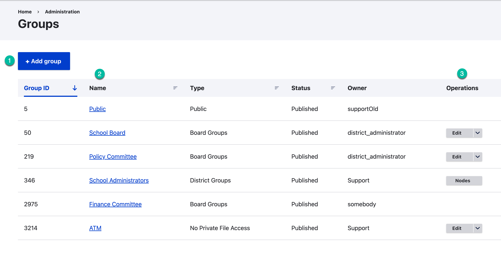
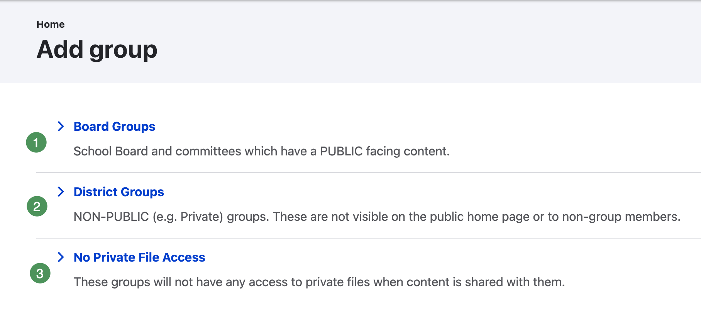
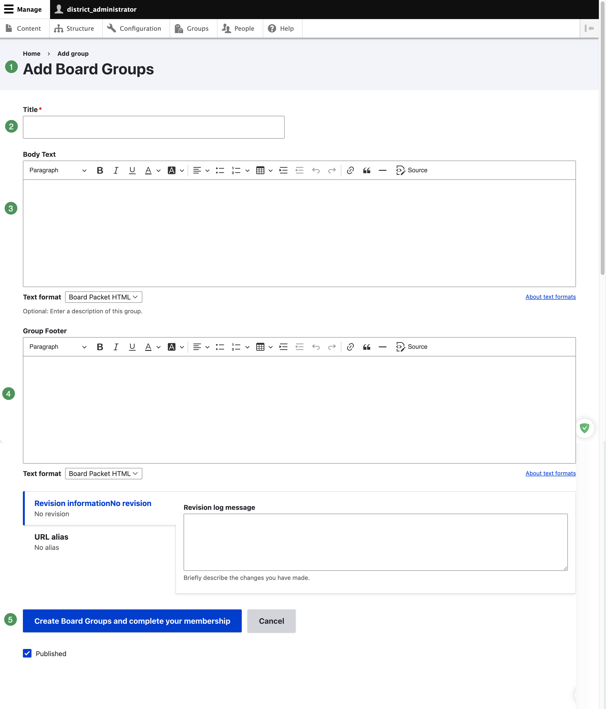
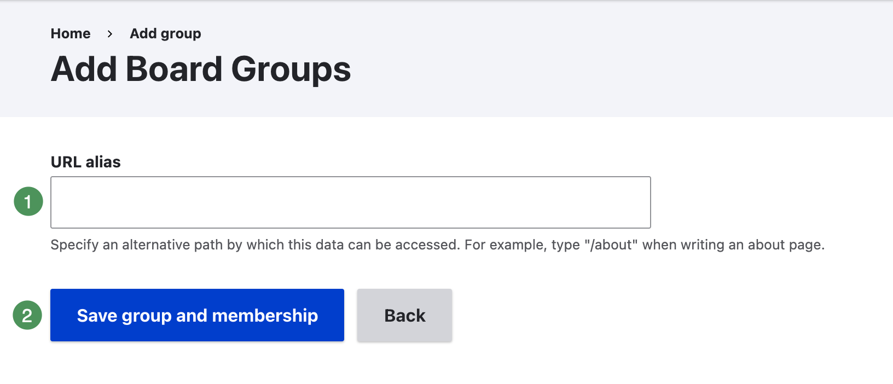

# Groups

The Groups list shows group ID, name, type, publication status, owner, and available operations.

{ .doc-screenshot }

*Figure SB-DST-012. Groups list.*

## Review a group

1. Confirm the group name and type.
2. Open the group's operation menu or open the group.
3. Select **Members**.
4. Review existing members before adding another user.

## Add a group

1. Select **Add group** from the Groups page.
2. Select the group type only after confirming its intended audience and access.

{ .doc-screenshot }

*Figure SB-DST-025. Select the group type carefully; it cannot be changed later.*

3. Enter the approved group name and details.

{ .doc-screenshot }

*Figure SB-DST-026. Enter the approved group home-page information.*

4. Save and verify the group.

{ .doc-screenshot }

*Figure SB-DST-027. Save the new group after verifying its type and details.*
5. Add approved members and Group Administrators.

### Choose the correct type

- **Board Groups** are public-facing groups for published agendas and related content.
- **District Groups** are internal groups without a public presence.
- **No Private File Access** supports internal review of shared content without access to private attachments.

!!! warning "Group Type cannot be changed"
    A group's type cannot be changed after creation. If the wrong type is selected, create a new group using the correct type and move content under an approved plan.

!!! important "ATM is already provided"
    Do not create another **ATM (Administrative Team)** group. schoolboard.net provisions ATM as a No Private File Access group and assigns the designated District Administrator during setup. Email schoolboard.net Support to request administration or membership changes.

## Public site home page

The public site home page belongs to a group that schoolboard.net Support administers by default. This prevents an administrator from inadvertently publishing content to the district's primary public landing page.

If a District Administrator needs to edit the site home page:

1. Email schoolboard.net Support with the requested editor and reason.
2. Support temporarily adds the District Administrator as a Group Administrator of the site-home-page group.
3. Make and verify the approved changes.
4. Email Support when the work is complete and request removal from the group.

!!! warning "Temporary access is recommended"
    Request removal after the approved site-home-page edits are finished. Limiting this access reduces the risk of accidental changes to the district's public landing page.

## Related Topics

- [Group memberships](memberships.md)
- [Roles and access](roles.md)
- [Security policies](security-policies.md)
- [Review notes](reference.md)
