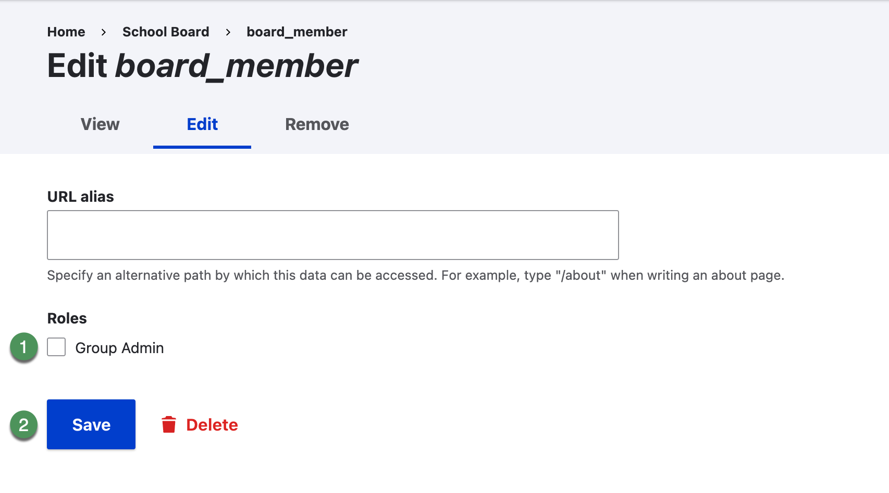
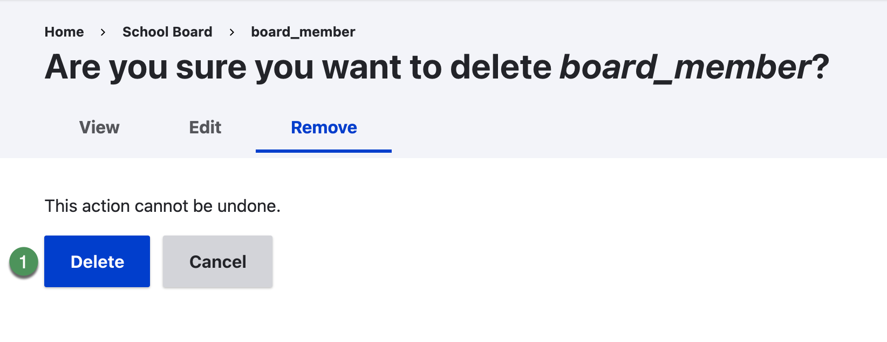

# Group memberships

Use a group's Members tab to review, add, edit, or remove membership.

{ .doc-screenshot }

*Figure SB-DST-014. Group membership list.*

## Add an existing user

1. Confirm that the account exists and is active.
2. Open the correct group and select **Members**.
3. Select **Add member**.
4. Begin entering the username and select the correct autocomplete result.
5. Leave **URL alias** empty unless the district has an established reason to use it.
6. Select **Group Admin** only when approved.
7. Select **Save** and verify the Members list.

{ .doc-screenshot }

*Figure SB-DST-016. Add an existing user to a group.*

## Edit a membership

1. Open the operation for the correct member and select **Edit**.
2. Select or clear **Group Admin** according to approved access.
3. Leave **URL alias** unchanged unless a documented requirement applies.
4. Select **Save** and verify the role.

{ .doc-screenshot }

*Figure SB-DST-017. Open the membership Operations menu.*

{ .doc-screenshot }

*Figure SB-DST-018. Edit a group membership.*

## Remove a membership

1. Confirm the username and group.
2. Open the membership operation and select **Remove**.
3. Read the confirmation.
4. Select **Delete** to remove the membership or **Cancel** to leave it unchanged.
5. Verify the Members list.

{ .doc-screenshot }

*Figure SB-DST-020. Remove a group membership.*

!!! warning "Membership versus account"
    This procedure acts on the group membership. It is separate from blocking or cancelling the user account. Reviewers should confirm that the confirmation wording is sufficiently clear.

## Related Topics

- [Groups](groups.md)
- [Roles and access](roles.md)
- [Block and restore access](block-access.md)
