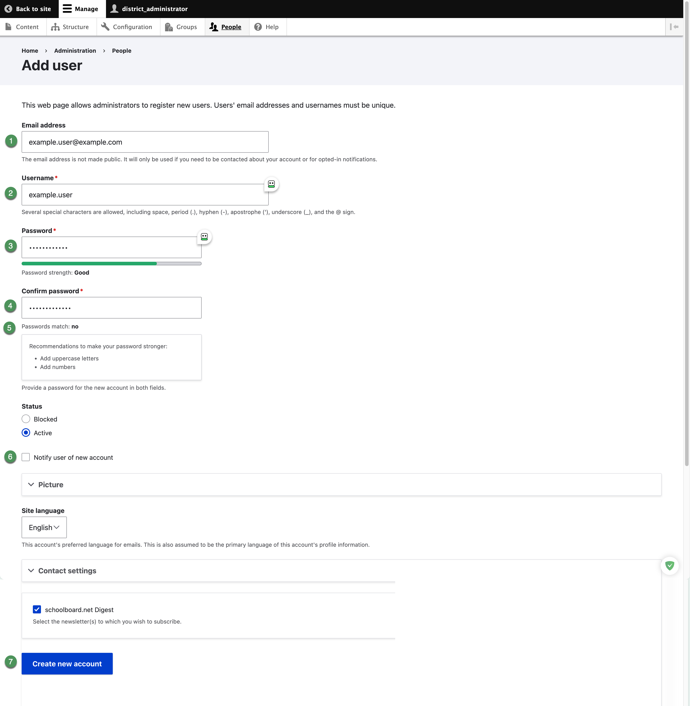
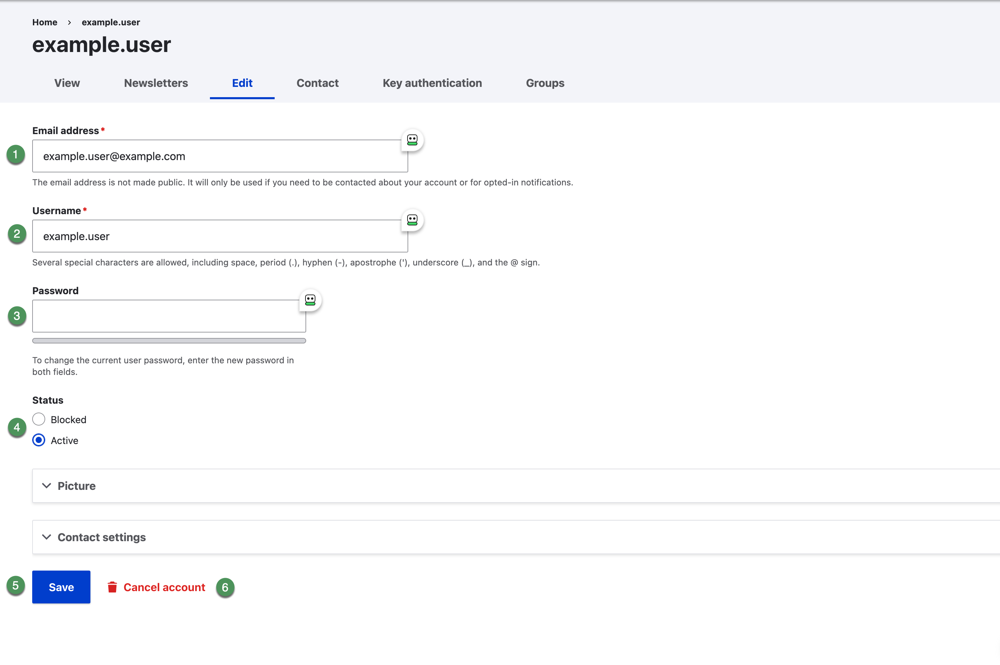

# Add and edit users

Search before creating an account. Email addresses and usernames must be unique.

## Add a user

1. Open **People** and select **Add user**.
2. Enter the person's **Email address**.
3. Enter a unique **Username**.
4. Enter the initial password in **Password** and **Confirm password**.
5. Confirm that the passwords match.
6. Select **Active** unless access must remain unavailable.
7. Select **Notify user of new account** only when the email address is verified and the account is ready.
8. Leave optional settings at district defaults unless a documented requirement applies.
9. Select **Create new account**.
10. Search for the username and verify the result.

{ .doc-screenshot }

*Figure SB-DST-006. Add user form.*

!!! note "Group access"
    Creating the account does not necessarily provide access to private Board materials. Add the user to each approved group separately.

## Edit a user

1. Find the correct account on **People**.
2. Select **Edit**.
3. Change only fields supported by an approved request.
4. To reset a password administratively, enter the new value in both password fields.
5. Use **Status** to select **Active** or **Blocked**.
6. Select **Save** and verify the People list.

{ .doc-screenshot }

*Figure SB-DST-008. Edit user account.*

!!! warning "Account cancellation"
    **Cancel account** is separate from blocking and may be destructive depending on site configuration. This review draft recommends blocking when reversible suspension is sufficient.

## Related Topics

- [Group memberships](memberships.md)
- [Block and restore access](block-access.md)
- [Safety and troubleshooting](safety-help.md)

