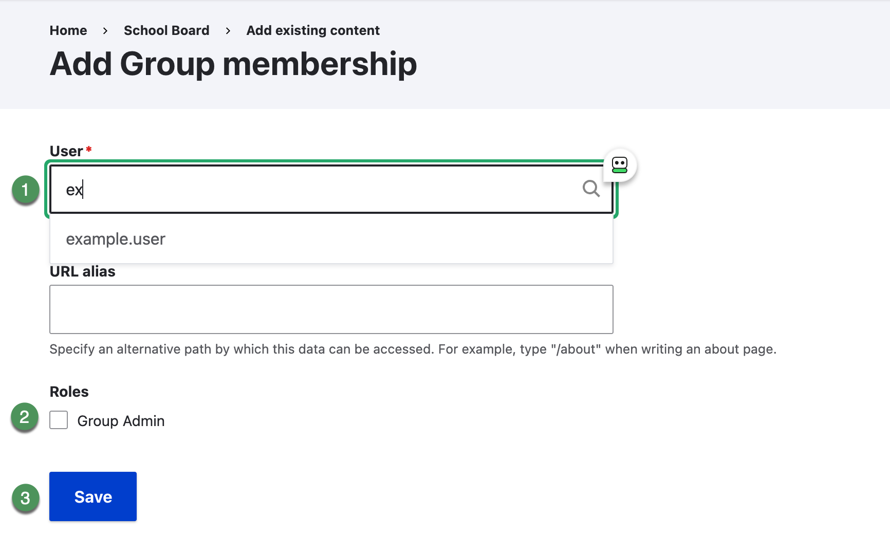

# Add a group member

Add only an existing schoolboard.net account that has been approved for the group.

## Add the membership

1. Open the correct group and select **Members**.
2. Select **Add member**.
3. Begin entering the username in **User**.
4. Select the correct result from the autocomplete list.
5. Leave **URL alias** empty unless the district has given specific instructions.
6. Do not assign additional roles unless a District Administrator has approved them.
7. Select **Save**.
8. Return to the Members list and verify the username.

{ .doc-screenshot }

*Figure SB-DST-016. Add an existing user to the group.*

!!! note "User not found"
    If autocomplete does not find the user, do not create a substitute account or select a similar name. Ask a District Administrator to confirm or create the account.

## Related Topics

- [View group members](view-members.md)
- [Safety and troubleshooting](safety-help.md)
