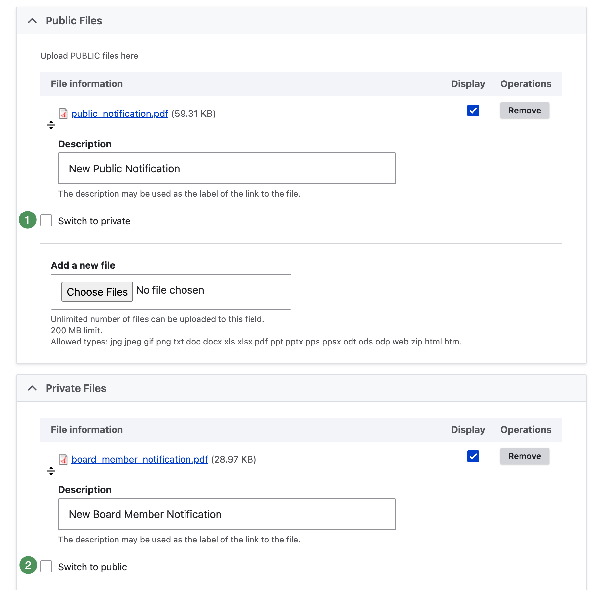
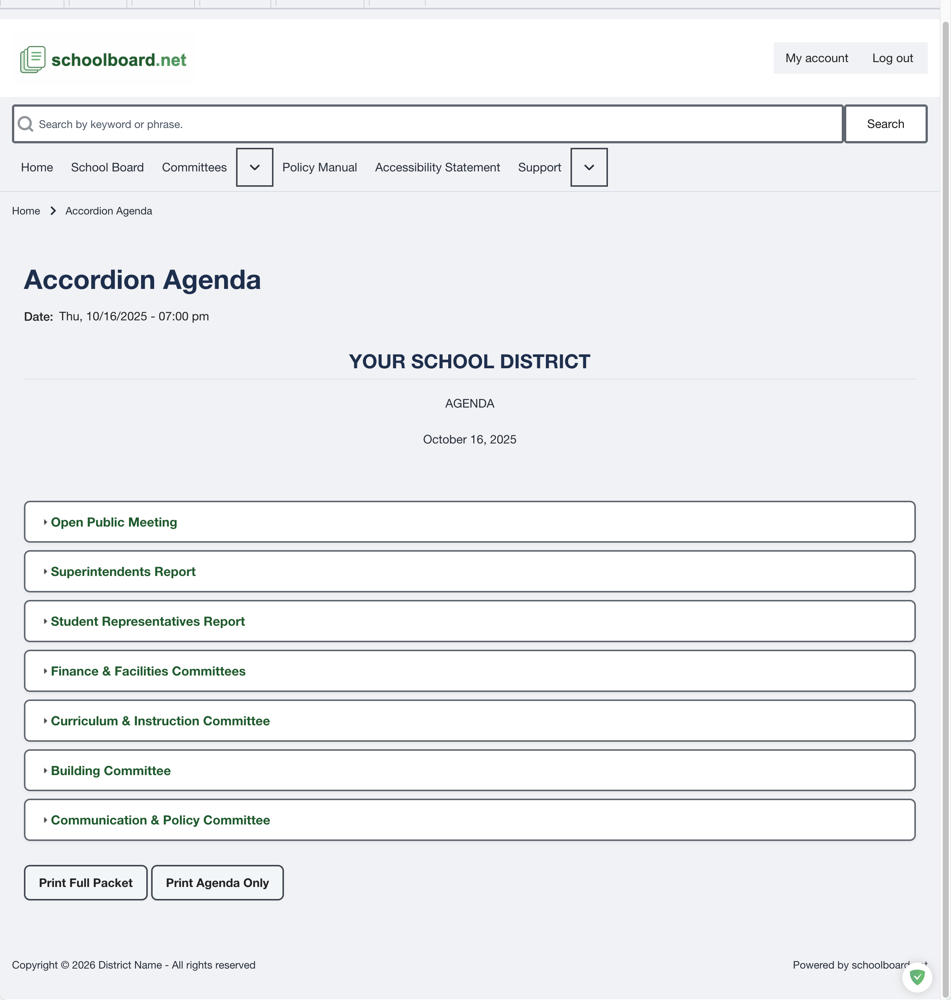

# Create agendas and add attachments

A Group Administrator may create and update agendas for an assigned group and add the approved files that support each agenda item. District Administrators can perform the same agenda actions.

{ .doc-screenshot }

*Figure SB-AAC-014. Anatomy of a completed Accordion Agenda section.*

## Before you begin

- Confirm that you are working in the correct group.
- Confirm the meeting title, date, time, and publication status.
- Use only approved public or restricted attachments.
- Confirm the intended access level before publishing an attachment.

## At a glance

1. Open the assigned group and begin a new agenda or open the approved agenda draft.
2. Enter or verify the meeting details.
3. Add agenda sections and items in the approved order.
4. Add each attachment to the correct agenda item.
5. Confirm the attachment title and access setting.
6. Keep **Visibility** Private, **Notifications** unchecked, and **Published** unchecked while drafting.
7. Save and review the saved draft.
8. Publish and notify only after review is complete.

!!! tip "Recommended workflow"
    Use [Draft Mode](best-practices.md#work-in-draft-mode) instead of relying on Preview. Preview is an administrator view and does not show the anonymous public experience.

## Before publishing

- Confirm the correct group and meeting.
- Confirm that agenda sections are in the intended order.
- Confirm that each attachment is attached to the correct item.
- Confirm that public and restricted materials have the correct access setting.
- Review the saved draft and open every attachment.
- Sign out after publication and verify the public view.

!!! warning "Protect restricted material"
    Do not publish an attachment until its access setting has been verified. If you are uncertain whether a file should be public, stop and confirm with the District Administrator or other designated district approver.

## Correct an attachment placed in the wrong area

When a file was added under the wrong public or private heading, use the **Switch to Private** or **Switch to Public** checkbox and save. The file moves automatically and does not need to be uploaded again.

{ .doc-screenshot }

*Figure SB-AAC-019. Move an existing attachment between public and private areas.*

## Verify the published result

After saving the publication settings, the site displays the agenda. Sign out and reopen it to confirm the anonymous public view.

{ .doc-screenshot }

*Figure SB-AAC-020. Verify the published agenda after signing out.*
