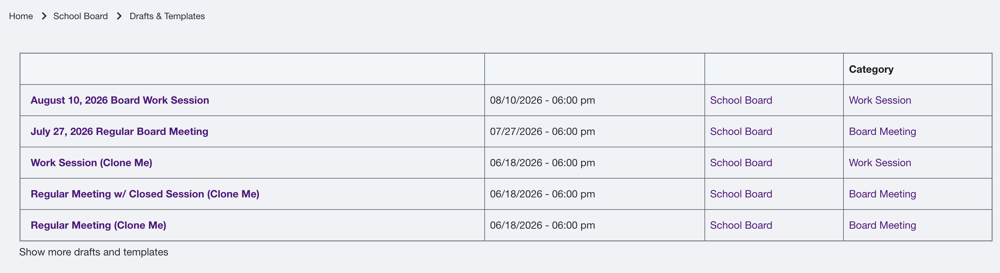
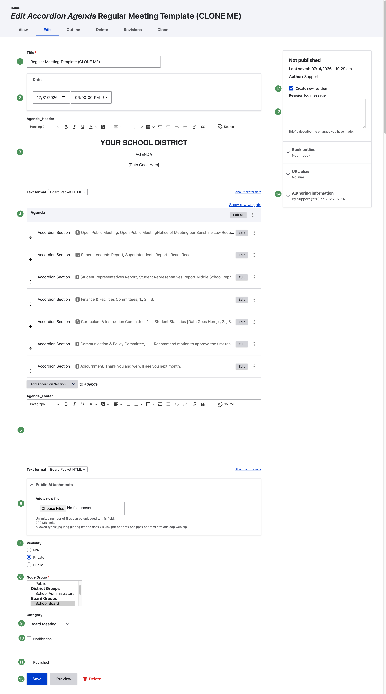

# Working with Drafts & Templates

Most districts maintain reusable templates for their common meeting types. Cloning the appropriate template is the preferred way to prepare a new agenda because it preserves the district's approved structure and recurring content.

## Common template types

- Regular Board Meeting
- Regular Board Meeting with Closed Session
- Work Session
- Special Meeting
- Budget Workshop
- Organizational Meeting
- Committee Meeting

Use a clear name such as **Regular Meeting Template (CLONE ME)** so administrators do not mistake the master template for a current meeting.

## Find a template

Open **Drafts & Templates** from the group home page. Items are listed in reverse date order, newest first.

{ .doc-screenshot }

*Figure SB-AAC-010. Find additional drafts and templates with Show More.*

- Current drafts normally appear near the top.
- Give permanent templates an intentionally older meeting date so they remain near the bottom.
- Select **Show More** when the desired template is not visible.

## Clone a template

1. Open the appropriate master template.
2. Select **Clone** from the top menu.

{ .doc-screenshot }

*Figure SB-AAC-002. Open the appropriate master template.*

{ .doc-screenshot }

*Figure SB-AAC-008. Select Clone from the top menu.*

3. Replace the **Clone of...** title with the correct meeting title.
4. Update the meeting date, time, header, and placeholder content.
5. Click the correct **Group**, even when it already appears highlighted.
6. Keep the agenda in [Draft Mode](best-practices.md#work-in-draft-mode) during preparation and review.
7. Save. The independent copy appears in **Drafts & Templates**.

{ .doc-screenshot }

*Figure SB-AAC-009. Update the cloned agenda and actively select its Group.*

!!! important "Actively select the Group"
    A highlighted Group is not necessarily selected. Click the destination Group before saving. An unassigned agenda may appear to be missing, may not display on the expected group page, and may not notify the intended members.

Changes to the cloned agenda do not change the master template.

## Maintain stable master templates

- Limit structural changes to designated administrators.
- Change a master template only when the district intentionally changes its standard meeting format.
- Keep separate templates for meeting types with meaningfully different structures.
- Include recurring sections and blank reusable content blocks when that reduces repetitive work.

!!! tip "Need help creating a template?"
    Send schoolboard.net Support a district-approved outline, Word document, or sample agenda. The schoolboard.net “magical elves” can build a reusable template, which is often the quickest way to learn the system and get started consistently.
