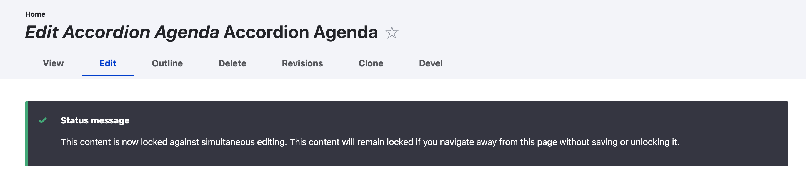
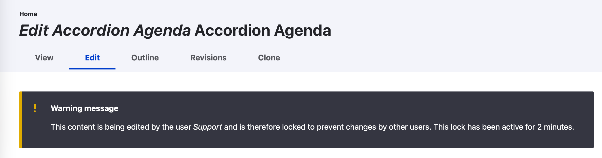
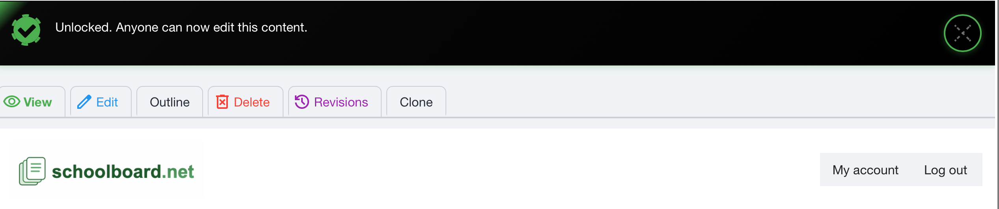

# Edit Locks and Safe Agenda Editing

schoolboard.net prevents two administrators from editing the same agenda at the same time. When an administrator opens an agenda for editing, the system locks that agenda until the editor **saves** it or deliberately **unlocks** it.

## When you begin editing

After you open the Edit form, a status message confirms that the content is locked against simultaneous editing.

{ .doc-screenshot }

*Figure SB-AAC-021. Opening the Edit form locks the agenda for the current editor.*

The lock protects your work from being overwritten by another administrator. It also remains active if you navigate away without saving or unlocking the agenda.

!!! tip "Best practice: Save to release the lock"
    Complete your work and select **Save**. Saving preserves the changes and releases the edit lock. Do not leave the Edit form open longer than necessary.

## When another administrator has the lock

If another administrator tries to edit the same agenda, a warning identifies the current editor and how long the lock has been active.

{ .doc-screenshot }

*Figure SB-AAC-022. The warning identifies the current editor and the age of the lock.*

Do not attempt to make competing changes. Contact the named user and ask that person to:

1. finish the current work;
2. select **Save** to preserve the changes and release the lock; or
3. select **Unlock** if no changes were made and nothing needs to be saved.

Refresh or reopen the agenda after the other administrator releases the lock.

!!! warning "Do not work around an active lock"
    The lock indicates that another administrator may have unsaved work. Coordinate with the named editor before proceeding so content is not lost or overwritten.

## If the lock becomes stuck

If the named editor has saved or unlocked the agenda but the lock remains, contact a District Administrator. **Only a District Administrator may break another user's stuck content lock.**

Breaking a lock is a last resort. Before requesting it, confirm that the named editor—and anyone else with access—is not editing the content and that no unsaved work needs to be preserved.

!!! warning "Last resort: District Administrator only"
    A Group Administrator cannot break another user's stuck content lock. Ask a District Administrator for help only after confirming that nobody is editing the content. Never request an override for an active editor.

## Use Unlock only when no changes were made

The **Unlock** button appears at the bottom of the Edit form with the Save and Preview controls.

{ .doc-screenshot }

*Figure SB-AAC-023. Use Unlock only when the Edit form can be closed without saving changes.*

Select **Unlock** when you opened the form but made no changes and do not need to save. If you changed anything that should be retained, select **Save** instead.

After a successful unlock, schoolboard.net displays **Unlocked. Anyone can now edit this content.**

{ .doc-screenshot }

*Figure SB-AAC-024. The confirmation message verifies that the lock was released.*

After seeing this message, another authorized administrator may reopen the agenda for editing.

## Safe editing checklist

- Confirm that you opened the correct agenda before editing.
- Coordinate ownership when several administrators are preparing one meeting.
- Save regularly while working in Draft Mode.
- Save before leaving the Edit form when changes must be retained.
- Use Unlock only when no changes were made.
- If a lock warning appears, contact the named editor rather than starting competing work.
- Escalate a stuck lock to a District Administrator; only that role can break it as a last resort.

## Related topics

- [Agendas and attachments](agendas.md)
- [Group Administrator best practices](best-practices.md)
- [Complete Accordion Agenda workflow](https://docs.schoolboard.net/accordion-agenda/)
