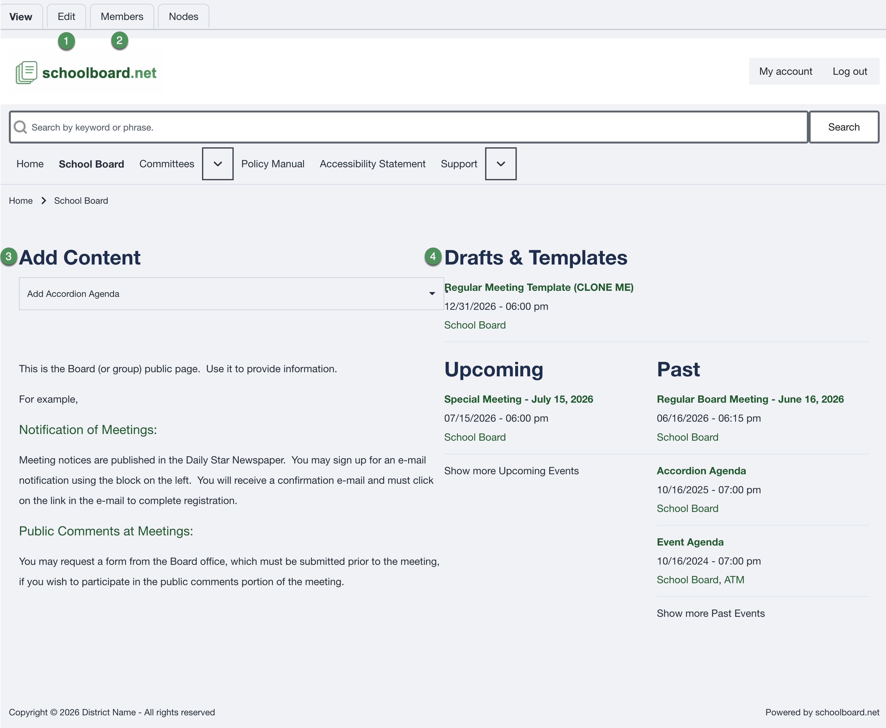
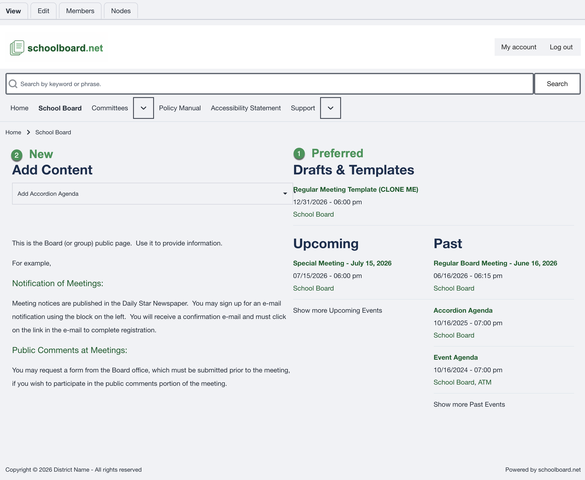
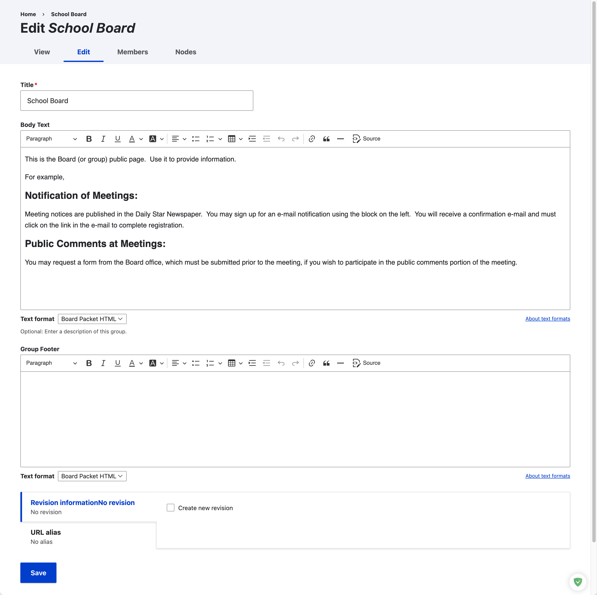

# Understand the Group Home Page

When you are signed in as a Group or District Administrator, the group home page provides the main tools for managing that group.

## Main administrator tools

1. **Edit**  
   Update the content displayed on the group home page.

2. **Members**  
   View and manage the users assigned to the group.

3. **Add Content**  
   Create new group content, including an Accordion Agenda built from scratch.

4. **Drafts & Templates**  
   Open unpublished content and reusable agenda templates.

## Preferred way to create an Accordion Agenda

Most agendas should be created by cloning a template.

### Preferred method: Drafts & Templates

Open **Drafts & Templates**, locate the appropriate meeting template, and clone it. This preserves recurring sections, formatting, and standard content.

### Alternative: Add Content

Use **Add Content** when no suitable template exists and the agenda must be built from scratch.

!!! tip "Best practice"
    Use templates for recurring meeting types. Consistent templates reduce preparation time and help prevent accidental changes to the agenda structure.

## Edit the group home page

Select **Edit** on the group home page to update the public information for the group.

Review the title, body text, and optional group footer before saving. Create a new revision when the district wants a record of the change.

!!! warning
    The group title and basic page structure should remain consistent unless the district has approved a change.
