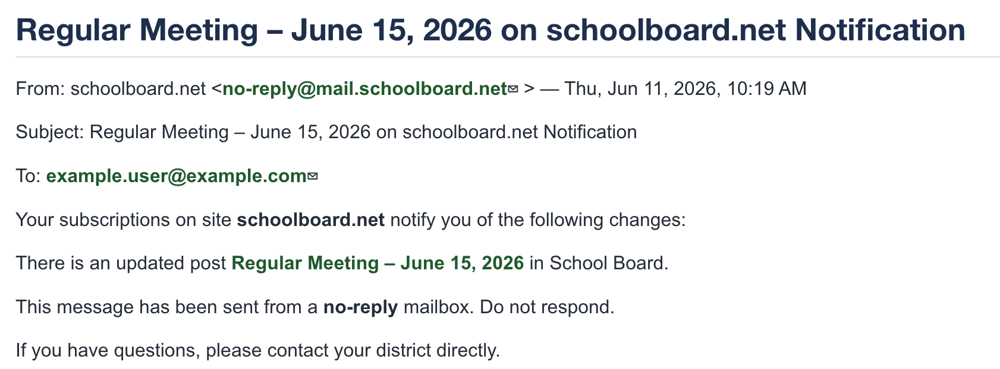

# Notifications and Revisions

Notifications should match both the agenda's visibility and the intended audience. Enter meaningful **Revision Text** because that text appears in the notification and tells recipients what changed.

## Publish and notify

When the reviewed draft is ready:

1. Verify the title, date, assigned Group, sections, links, and attachments.
2. Confirm every confidential file or expandable item is in a clearly marked private area.
3. Change **Visibility** to **Public**.
4. Select **Published**.
5. Select **Notifications** when notices should be sent.
6. Enter useful **Revision Text**.
7. Save.
8. Immediately reopen the agenda, clear **Notifications**, and save again.
9. Sign out and open the agenda as a public visitor to verify the public result.

{ .doc-screenshot }

*Figure SB-AAC-006. Public notification linking recipients to the agenda.*

!!! warning "Clear Notifications after every send"
    Treat each notification as a conscious decision. After publishing and sending a notice, immediately edit the agenda, clear **Notifications**, and save. Leaving Notifications selected can cause another notice to be sent during a later edit or save.

!!! important "Preview is not a public preview"
    Preview shows the agenda as a signed-in Group Administrator. It does not simulate the anonymous public view. schoolboard.net recommends reviewing a saved draft and then signing out to verify the published public view.

## Notify group members without notifying the public

Use this procedure only after the agenda has already been published and its original notifications have been sent.

1. Open the agenda and make the revisions.
2. Enter a clear description in **Revision Text**.
3. Change **Visibility** to **Private**.
4. Select **Notifications**.
5. Save. The assigned group members receive the notification.
6. Immediately reopen the agenda.
7. Change **Visibility** back to **Public**.
8. Clear **Notifications**.
9. Save again.

{ .doc-screenshot }

*Figure SB-AAC-007. Revision Text tells group members what changed.*

!!! warning "Restore public visibility immediately"
    The public cannot view the agenda while it is Private. Complete the second save immediately and verify the public page.

## Write useful Revision Text

Examples include **Added Finance Committee report**, **Replaced Attachment C**, **Corrected meeting start time**, and **Added Executive Session item**. Minor spelling or formatting corrections may not require another notification; follow district practice.

## Subscribe to public notifications yourself

Group Administrators should subscribe to the group's public notifications using a personal email address or another monitored account outside the district notification list. This independently confirms that the notice was sent, its links work, and the agenda is publicly accessible.

Use [Subscribe to Public Notifications](https://docs.schoolboard.net/public/notifications/) in the Public Guide for the complete sign-up procedure. Subscription is not active until the administrator selects the link in the confirmation email.

!!! important
    If you do not receive the expected public notification, do not assume subscribers received it. Verify publication, notification settings, and email delivery.
