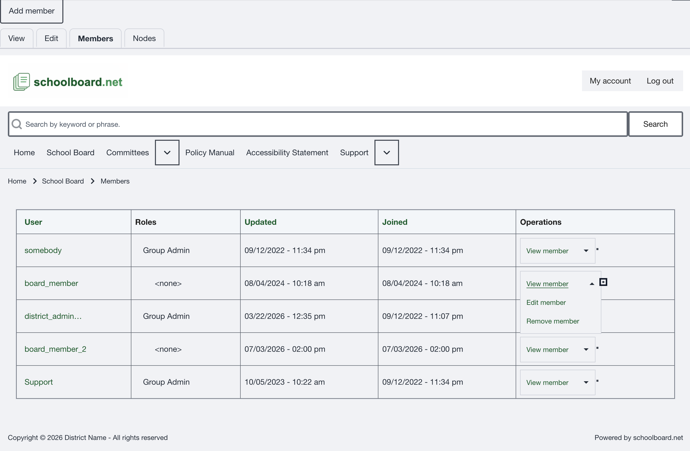

# Remove a group member

Removing membership affects only the selected group. It does not block, cancel, or delete the user account.

## Open the membership operation

1. Open the correct group's **Members** tab.
2. Find the exact username.
3. Open the member's **Operations** menu.
4. Select **Remove member**.

{ .doc-screenshot }

*Figure SB-DST-017. Open the membership Operations menu.*

!!! note "Edit member is outside this role"
    The shared Operations menu may display **Edit member**. This guide authorizes Group Administrators to add and remove membership only. Contact a District Administrator when a membership role must be changed.

## Confirm removal

1. Read the confirmation and verify the user and group.
2. Select **Delete** to remove the membership.
3. Select **Cancel** if anything is incorrect or uncertain.
4. Return to the Members list and verify that the membership is gone.

{ .doc-screenshot }

*Figure SB-DST-020. Confirm or cancel removal of the group membership.*

!!! warning "Do not continue if uncertain"
    If the username or group is not the one you intended, select **Cancel** and start again.

## Related Topics

- [View group members](view-members.md)
- [Safety and troubleshooting](safety-help.md)
