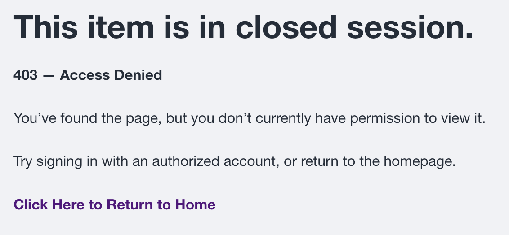

# Safety and troubleshooting

## Agenda edit lock problems

| Problem | What to do |
| --- | --- |
| A warning says another administrator is editing the agenda | Note the editor's name and lock duration. Contact that person and ask them to **Save** or select **Unlock** if no changes were made. |
| The named editor is still working | Wait. Do not try to work around the active lock. |
| The editor finished, but the lock remains | Reopen or refresh the agenda. If it is still locked, contact a District Administrator. |
| The content lock is stuck | Only a District Administrator can break another user's lock. This is a last resort after confirming that nobody is editing and no unsaved work needs to be preserved. |

See [Edit Locks and Safe Agenda Editing](edit-locks.md) for the complete procedure and screenshots.

## Browser spell check is not working

Confirm that spell checking and the intended language are enabled in the browser or device. Work in the normal visual editor rather than **Source** view, then refresh or reopen the form after changing a browser setting.

Follow [Browser Spell Check and Proofreading](https://docs.schoolboard.net/authoring/browser-spell-check/) for Chrome, Edge, Safari, iPad and iPhone instructions and a complete troubleshooting sequence. If a district-managed browser prevents changes, contact district technical support.

## The user does not appear in autocomplete

- Confirm the spelling of the username.
- Confirm that the person already has a schoolboard.net account.
- Contact a District Administrator if the account is missing or blocked.

## The user still cannot see group materials

- Confirm that the correct group was changed.
- Confirm that the username appears in the Members list.
- Ask the user to sign out and sign in again.
- Contact a District Administrator if access remains incorrect.

## The wrong membership was removed

Return to **Add member** and restore the correct existing user. Notify the District Administrator if the change affected access during an active meeting or review period.

## An operation is not available

Do not try to work around missing permissions. Confirm that you are in the assigned group and contact a District Administrator.

## 403 — Access Denied

A 403 message means the content exists, but the current account does not have permission to view it.

{ .doc-screenshot }

1. Confirm that you are signed in with the correct account.
2. Confirm that you are a Group Administrator or member of the affected Group.
3. Confirm that the agenda and item are assigned to the expected Group.
4. Contact a District Administrator if your access should be changed.

## 404 — Page Not Found

A 404 message means the address does not currently lead to an available page. The content may have moved, been archived, become unpublished, or have an incorrect Group assignment.

{ .doc-screenshot }

1. Return to the Group home page and locate the agenda again.
2. Check **Drafts & Templates** and select **Show More**.
3. Ask a District Administrator to search **Content**, verify the newest revision, and confirm Group assignment and publication status.
4. Do not recreate the agenda until the original has been located or confirmed missing.

## Safety checklist

- Use only the access assigned to you.
- Verify the group and username before saving.
- Avoid changing unfamiliar roles or URL aliases.
- Never share administrator credentials.
- Sign out on shared devices.
- Save agenda changes to preserve the work and release the edit lock.
- Escalate a confirmed stuck content lock to a District Administrator.
