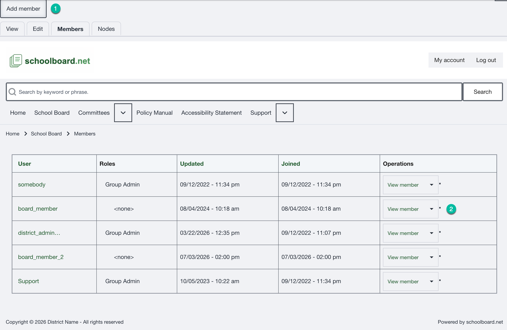

# View group members

Open the assigned group and select **Members**. The list identifies each user, any group membership role, the update and join dates, and available operations.

{ .doc-screenshot }

*Figure SB-DST-014. Review the current group membership list.*

## Before changing membership

1. Confirm the group name in the page heading or breadcrumb.
2. Look for the username in the existing Members list.
3. Do not add the same user twice.
4. If the username is unfamiliar or ambiguous, stop and confirm the correct account.

## Related Topics

- [Add a group member](add-members.md)
- [Remove a group member](remove-members.md)
