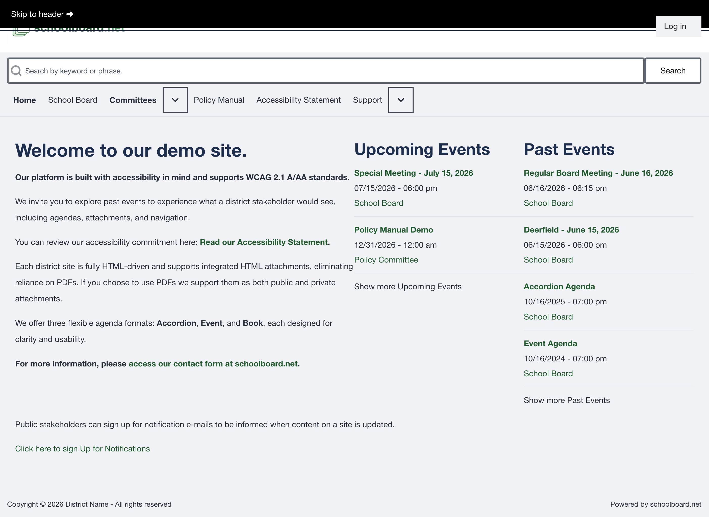

# Accessibility and Help

schoolboard.net documentation and district sites are designed to support keyboard navigation, responsive layouts, structured headings, meaningful links, and accessible on-page content.

## Use keyboard navigation

- Press **Tab** to move forward between interactive controls.
- Press **Shift+Tab** to move backward.
- Press **Enter** to open a link.
- Press **Enter** or **Space** to operate agenda headings and buttons.
- Use a visible skip link to move directly to the main page region when it appears.

{ .doc-screenshot }

*Keyboard focus reveals the skip link.*

## Use the site at different sizes

The site adapts to desktop, tablet, phone, and browser zoom. On smaller screens, navigation choices may move behind menu buttons. Page content remains available without requiring horizontal scrolling under normal responsive use.

## Prefer accessible on-page content

When an agenda provides a **Read...** control, select it to open accessible HTML content directly on the page. A downloadable file may also be available.

## Find accessibility information

Use the district site's **Accessibility Statement** for accessibility commitments and the appropriate district contact for accommodations or alternative formats.

## Report an accessibility barrier

Include:

- the meeting title and date;
- the page address;
- the browser and device;
- assistive technology, when applicable;
- the affected link, control, heading, or document; and
- what happened and what you expected.

Specific information helps the district investigate and respond more quickly.

## Related topics

- [Navigation and search](navigation-search.md)
- [Agendas and public materials](agendas-materials.md)
- [Subscribe to public notifications](notifications.md)
