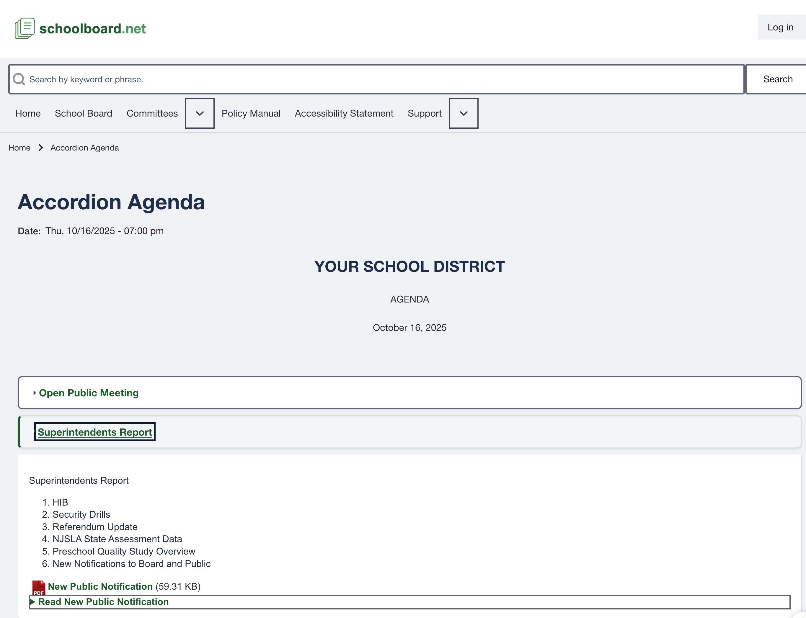

# Agendas and public materials

1. Confirm the meeting title and date.
2. Select an agenda heading to expand it.
3. Read the agenda item, motion, table, or list.
4. Open nested headings when an item contains more detail.
5. Select a linked filename to open a public attachment.
6. Select a **Read ...** heading to open expandable HTML within the page.
7. Select the heading again to collapse it.

{ .doc-screenshot }

*This consolidated view documents functions SB-PUB-006 through SB-PUB-009.*

!!! note
    Private materials are restricted to authorized users and do not appear as public agenda content.
