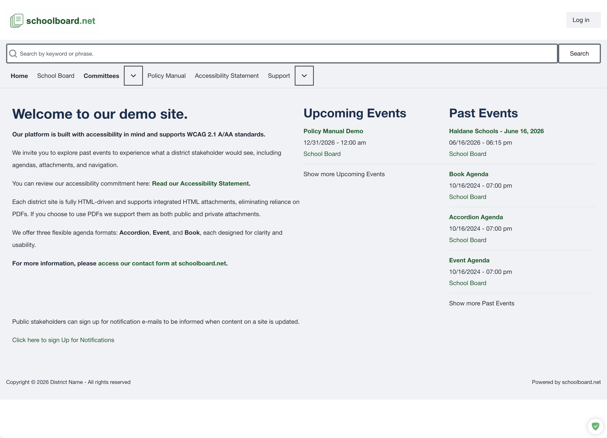

# Public Quick Start

Use these pages to find Board and committee meetings, read public agendas and materials, search, print, and subscribe to updates. No account is required for public content.

!!! note "Printable references"
    The online guide is the current and authoritative version. Select **Print this page** when a paper copy or locally saved PDF of this Quick Start is helpful. We are considering prepared accessible PDFs for short Quick Starts and checklists—not duplicate copies of every complete guide. Reviewer feedback about that approach is welcome.

    On an iPad or iPhone, use the browser's **Share** button in the toolbar, then select **Print**. The **How to print** button displays this reminder.

Review the [conventions used in this guide](conventions.md) for information boxes, screenshots, mobile navigation, and live-information guidance.

On a smaller screen, select **☰ Topics** to open the documentation menu.

<a class="task-card" href="meetings/">
<strong>1. Find a meeting</strong>
Use Upcoming Events or Past Events.
</a>

<a class="task-card" href="agendas-materials/">
<strong>2. Review the agenda</strong>
Expand sections and open public materials.
</a>

<a class="task-card" href="navigation-search/">
<strong>3. Search the site</strong>
Use keywords, phrases, and Advanced search.
</a>

<a class="task-card" href="printing/">
<strong>4. Print</strong>
Choose an agenda-only or full-packet view.
</a>

## Five-minute workflow

1. Open the district's schoolboard.net site.
2. Select a meeting under **Upcoming Events** or **Past Events**.
3. Confirm the meeting title, date, time, and group.
4. Expand the agenda sections you need.
5. Open a public filename or **Read ...** heading.
6. Use search, print, notifications, or accessibility features as needed.

{ .doc-screenshot }

*Public home page overview.*

!!! note
    District names, navigation choices, and available meeting formats can vary. Confirm the meeting date before relying on an agenda or attachment.

## More help

- [Subscribe to public notifications](notifications.md)
- [Use accessibility features or report a barrier](accessibility.md)
