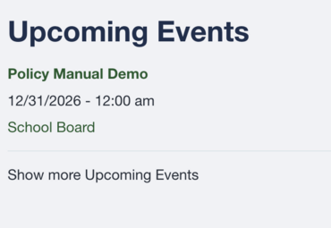
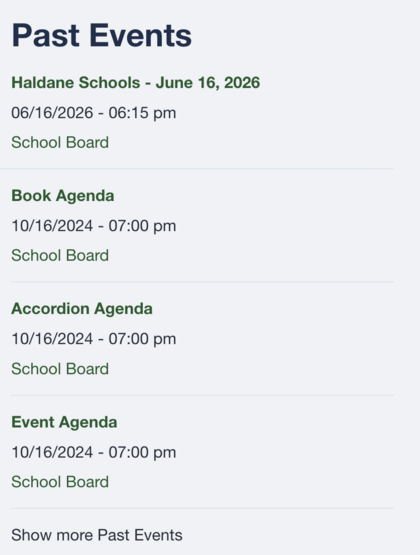

# Find a meeting

1. Open the district's schoolboard.net home page.
2. Look under **Upcoming Events** for a future meeting.
3. Look under **Past Events** for an earlier meeting.
4. Select **Show more Upcoming Events** or **Show more Past Events** if necessary.
5. Select the meeting title and confirm its date, time, and group.

{ .doc-screenshot }

*Upcoming Events.*

{ .doc-screenshot .doc-screenshot-narrow }

*Past Events.*

!!! tip
    Meeting titles can be similar. Confirm the date before relying on an agenda or attachment.
