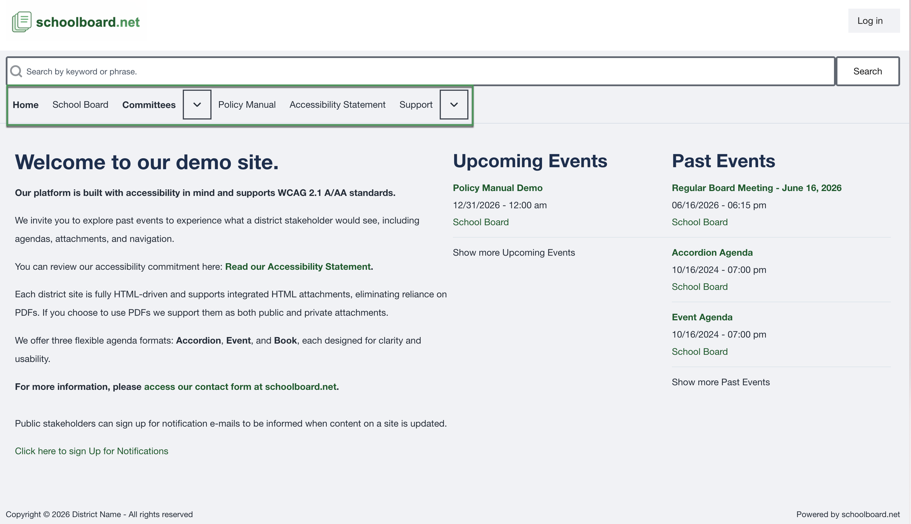
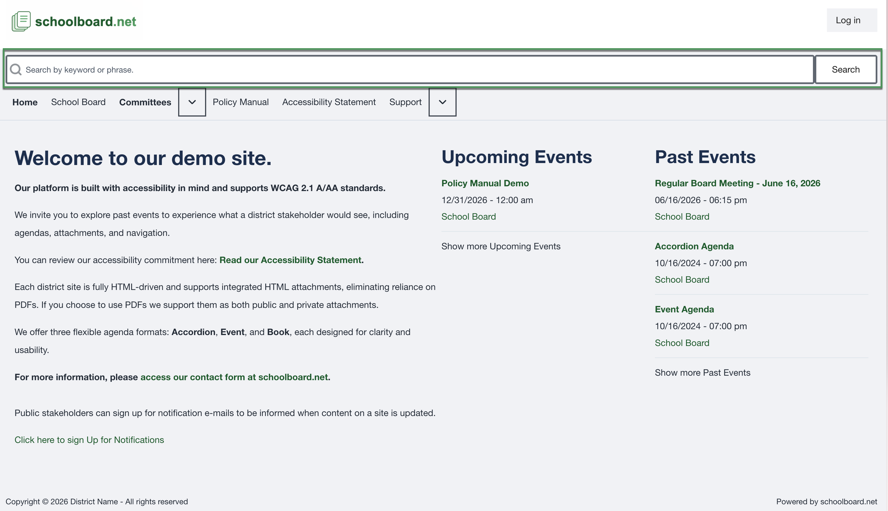

# Navigation and search

## Use the primary navigation

The navigation may include **Home**, **School Board**, **Committees**, **Policy Manual**, **Accessibility Statement**, and **Support**. Available items can vary by district.

{ .doc-screenshot }

## Search the site

1. Enter a keyword or phrase in **Search by keyword or phrase**.
2. Select **Search**.
3. Review the result title, excerpt, and date.
4. Open the result and confirm that it belongs to the meeting you need.

{ .doc-screenshot }

## Refine a search

Use **Advanced search** to find any word, an exact phrase, or to exclude words. Available content-type and language filters appear below the keyword fields.

{ .doc-screenshot }
