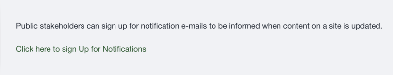
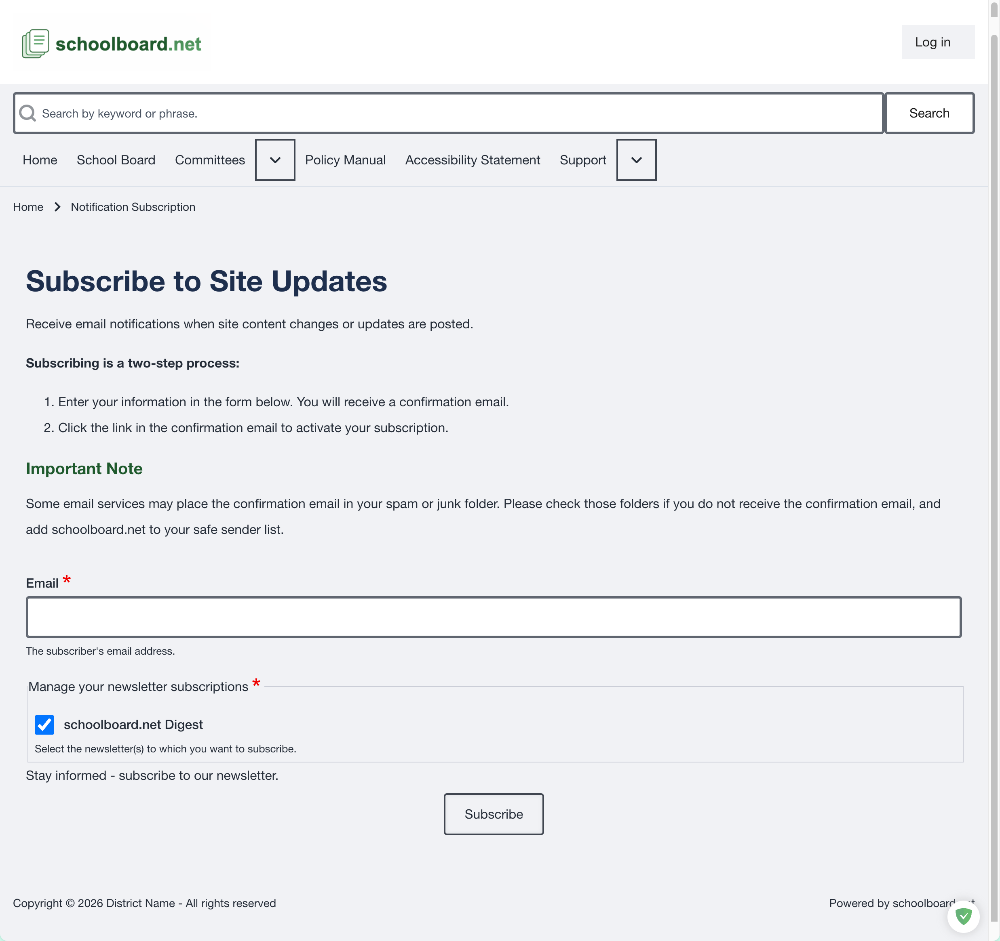

# Subscribe to Public Notifications

Public notifications let you know when district site content is published or updated. The live district site remains the current source of information.

## Open the subscription form

From the district home page, select **Click here to sign Up for Notifications**.

{ .doc-screenshot }

*Public notification sign-up link.*

## Subscribe to site updates

Subscribing is a two-step process:

1. Complete and submit the subscription form.
2. Open the confirmation email and select its activation link.

{ .doc-screenshot }

*Figure SB-PUB-015. Public notification subscription form.*

### Complete the form

1. Enter the email address where notifications should be delivered.
2. Confirm that **schoolboard.net Digest** is selected under **Manage your newsletter subscriptions**.
3. Select **Subscribe**.
4. Check the email account for a confirmation message.
5. Select the link in that message to activate the subscription.

!!! important "The confirmation link is required"
    Entering an email address does not complete the subscription. The recipient must select the confirmation link before notifications begin.

## If the confirmation email does not arrive

- Check spam, junk, and quarantine folders.
- Allow a few minutes for email delivery.
- Add schoolboard.net to the email account's safe-sender list when appropriate.
- Confirm that the email address was entered correctly.
- Submit the form again if necessary.

If the confirmation message still does not arrive, contact the district and include the email address used, the approximate subscription time, and the Group or page from which the form was opened.

## What a notification means

A notification indicates that site content was added or changed. Open the link in the message to view the current information on the district's schoolboard.net site.

Always rely on the live site rather than an older email or previously downloaded attachment.

## Related topics

- [Find a meeting](meetings.md)
- [Review agendas and public materials](agendas-materials.md)
- [Accessibility and help](accessibility.md)
