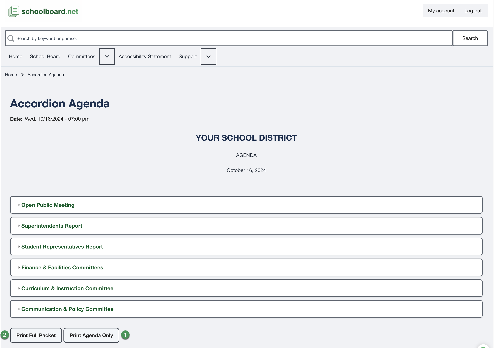

# Print an agenda

On agendas that provide print controls:

- Select **Print Agenda Only** for the agenda structure.
- Select **Print Full Packet** when the public supporting material should be included.
- The printable agenda opens in a new browser window.
- On a computer, review the browser print preview before printing or saving as PDF.
- Use browser zoom to enlarge text for on-screen reading.

{ .doc-screenshot }

!!! tip "Printing on an iPad or iPhone"
    After the printable agenda opens in a new window, select the browser's **Share** button, then select **Print**. The agenda's print controls prepare the printable view; they do not open the device's print controls.

!!! tip
    The live agenda remains the current source when meeting information changes after a packet is printed or saved.
