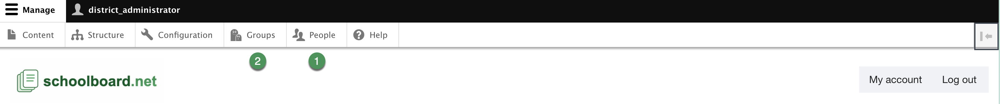

# Administration access

Use the administration toolbar to reach account and group management.

## Open the toolbar

1. Sign in with your assigned District Administrator account.
2. Select **Manage**.
3. Select **People** for user accounts or **Groups** for group membership.
4. Use **Back to site** to return to the public-facing district site.

{ .doc-screenshot }

*Figure SB-DST-002. District Administrator toolbar.*

!!! warning "Confirm the site"
    Administrator pages can change access to private materials and site configuration. Confirm the district site and account before making a change.

## Related Topics

- [People and users](people.md)
- [Groups](groups.md)
- [Safety and troubleshooting](safety-help.md)
