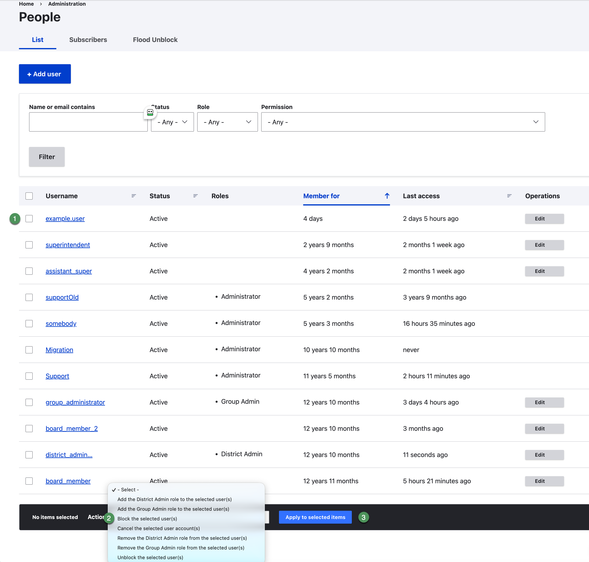

# Block and restore access

Blocking is the preferred review-draft procedure when access must be suspended but the account and history should be retained.

## Block accounts

1. Open **People** and find the user.
2. Confirm the username and current Active status.
3. Select the correct account checkbox.
4. Select **Block the selected user(s)** from **Action**.
5. Confirm that only intended accounts are selected.
6. Select **Apply to selected items**.
7. Refresh or filter the list and verify **Blocked** status.

{ .doc-screenshot }

*Figure SB-DST-022. Block selected user accounts.*

## Restore access

Use **Unblock the selected user(s)** only after approval. Review roles and group memberships before unblocking.

## Offboarding sequence

1. Block the account promptly.
2. Remove unnecessary administrator roles.
3. Remove group memberships when approved.
4. Preserve or reassign content according to district policy.
5. Cancel the account only when an approved procedure requires it.

## Related Topics

- [People and users](people.md)
- [Roles and access](roles.md)
- [Safety and troubleshooting](safety-help.md)
