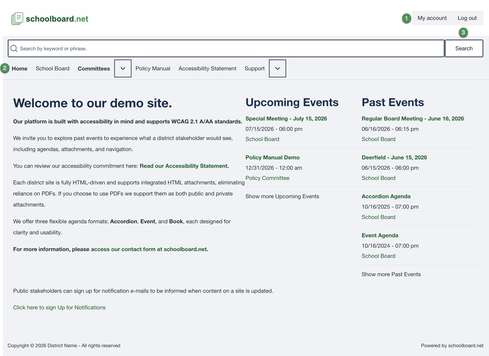
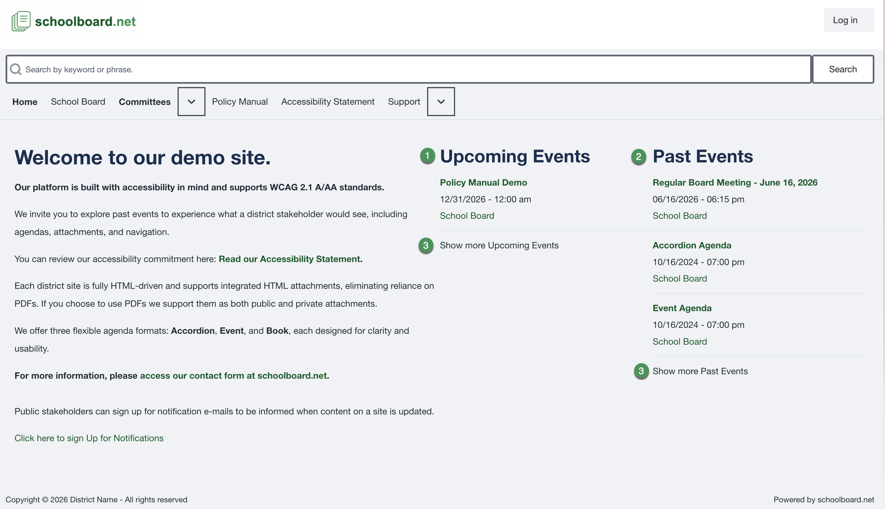
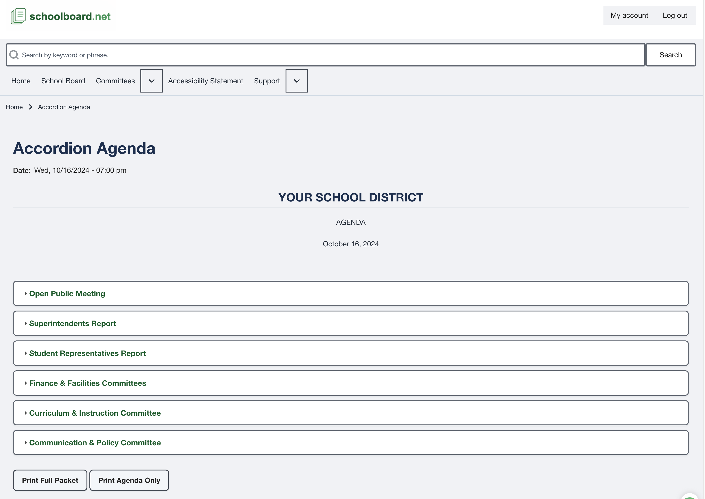

# Find a meeting

Open meetings from the current site so you can confirm the date and use the latest published version.

## Navigate the signed-in site

The header provides your account controls, site search, and primary navigation.

{ .doc-screenshot }

*Figure SB-BRD-007. Logged-in navigation and account controls.*

## Open the correct meeting

1. Select **Home**.
2. Look under **Upcoming Events** for a future meeting.
3. Look under **Past Events** for an earlier meeting.
4. Use **Show more Upcoming Events** or **Show more Past Events** when needed.
5. Select the meeting title.
6. Confirm the meeting date, time, and Board or committee name.

{ .doc-screenshot }

*Figure SB-BRD-008. Upcoming and past meeting lists.*

## Confirm the agenda

Check the meeting title and date before relying on the agenda or an attachment.

{ .doc-screenshot }

*Figure SB-BRD-009. Accordion Agenda header.*

!!! tip
    Meeting titles can be similar. Confirm the date every time, especially when reviewing a downloaded or printed copy.

## Related Topics

- [Review an agenda](review-an-agenda.md)
- [Meeting checklist](meeting-checklist.md)

## Revision History

| Version | Date | Status | Summary |
| --- | --- | --- | --- |
| 1.0 | 2026-07-13 | Review Draft | Online meeting-location procedure with approved navigation and agenda captures. |
