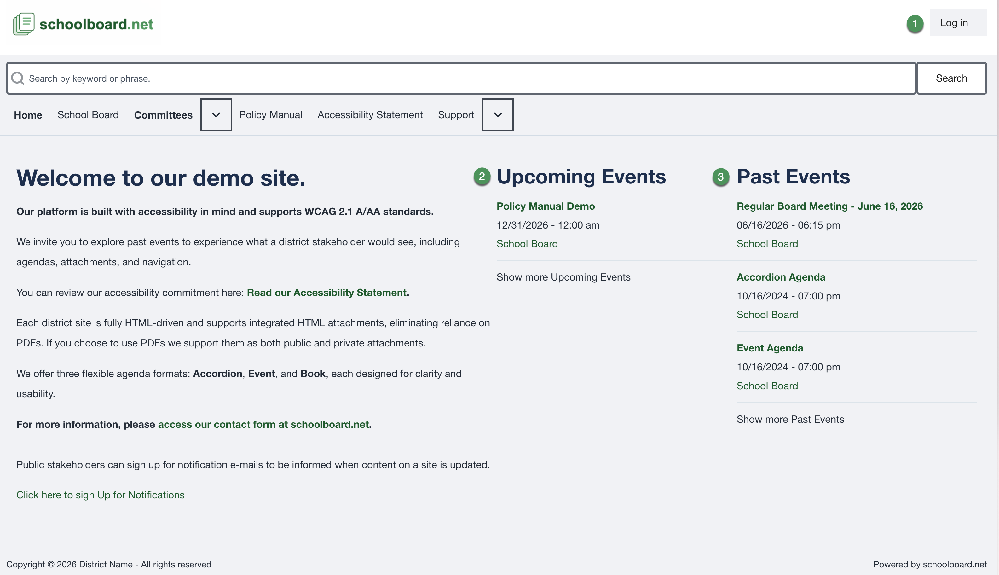

# Board Member Quick Start

Use this page to get from the district home page to the materials for your meeting.

On a smaller screen, select **☰ Topics** to open the documentation menu.

  <a class="task-card" href="sign-in/"><strong>1. Sign in</strong>Access authorized Board materials.</a>
  <a class="task-card" href="find-a-meeting/"><strong>2. Find a meeting</strong>Confirm the correct date and group.</a>
  <a class="task-card" href="review-an-agenda/"><strong>3. Review the agenda</strong>Open sections and supporting items.</a>
  <a class="task-card" href="materials/"><strong>4. Open materials</strong>Recognize public and private content.</a>

## Five-minute workflow

1. Open the district's schoolboard.net site.
2. Select **Log in** in the upper-right corner.
3. Enter your Board Member username or email address and password.
4. Return to **Home** after signing in if needed.
5. Select the meeting under **Upcoming Events** or **Past Events**.
6. Confirm the title, date, time, and Board or committee name.
7. Select an agenda heading to expand it.
8. Select a linked file or **Read ...** heading to open supporting material.
9. Confirm that authorized private materials are visible.
10. Refresh the live agenda shortly before the meeting.

{ .doc-screenshot }

*Figure SB-BRD-001. District home page and meeting lists.*

!!! warning "Use only your account"
    If another Board Member can see a private item that you cannot, contact the district administrator. Do not share accounts.

## What do you need to do?

- [Sign in or reset a password](sign-in.md)
- [Review or update My Account](my-account.md)
- [Find the correct meeting](find-a-meeting.md)
- [Review an Accordion Agenda](review-an-agenda.md)
- [Open public and private materials](materials.md)
- [Search or print](search-and-print.md)
- [Use keyboard navigation or get help](accessibility-and-help.md)

## Related Topics

- [Meeting preparation checklist](meeting-checklist.md)
- [Terminology and review notes](reference.md)

## Revision History

| Version | Date | Status | Summary |
| --- | --- | --- | --- |
| 1.1 | 2026-07-13 | Distribution | Added My Account procedures and responsive topic navigation. |
| 1.0 | 2026-07-13 | Review Draft | Initial online-first Board Member help site using the approved SB-BRD screenshot set. |
