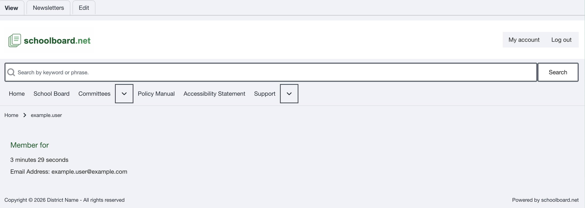
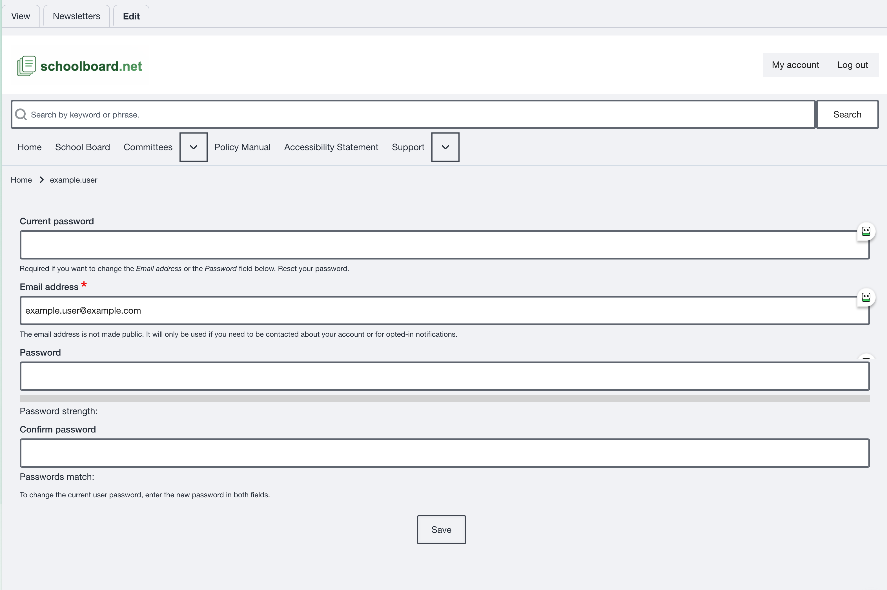

# My Account

Use **My account** to review your account summary, change the email address used for the account, or create a new password.

## Open My Account

1. Sign in to the district's schoolboard.net site.
2. Select **My account** in the upper-right corner.
3. Use **View** to review the account summary and current email address.
4. Select **Edit** when you need to change the email address or password.

{ .doc-screenshot }

*Figure SB-BRD-022. My Account overview.*

## Change your email address

1. Select **My account**, then select **Edit**.
2. Enter your current password.
3. Replace the value in **Email address**.
4. Leave **Password** and **Confirm password** empty when changing only the email address.
5. Select **Save**.
6. Return to **View** and confirm the updated address.

The email address is not displayed publicly. Keep it current because the site may use it for account contact, password recovery, and notifications you choose to receive.

## Change your password

1. Select **My account**, then select **Edit**.
2. Enter your current password.
3. Enter the new password in **Password**.
4. Enter the same new password in **Confirm password**.
5. Confirm that the password-strength and password-match feedback is acceptable.
6. Select **Save**.
7. Use the new password the next time you sign in.

{ .doc-screenshot }

*Figure SB-BRD-023. Edit email address or password.*

!!! warning "Current password required"
    Enter the current password before changing the email address or password. If you do not know it, use the password-reset process instead. Never include a real password in a screenshot, email, meeting note, or help request.

## Sign out

Select **Log out** when you finish, especially on a shared device or shared browser profile. Confirm that **Log in** replaces the account controls before leaving the device.

## Related Topics

- [Sign in or reset a password](sign-in.md)
- [Meeting preparation checklist](meeting-checklist.md)
- [Accessibility and help](accessibility-and-help.md)

## Revision History

| Version | Date | Status | Summary |
| --- | --- | --- | --- |
| 1.1 | 2026-07-13 | Distribution | Added My Account overview, email-address update, password change, and sign-out procedures. |
