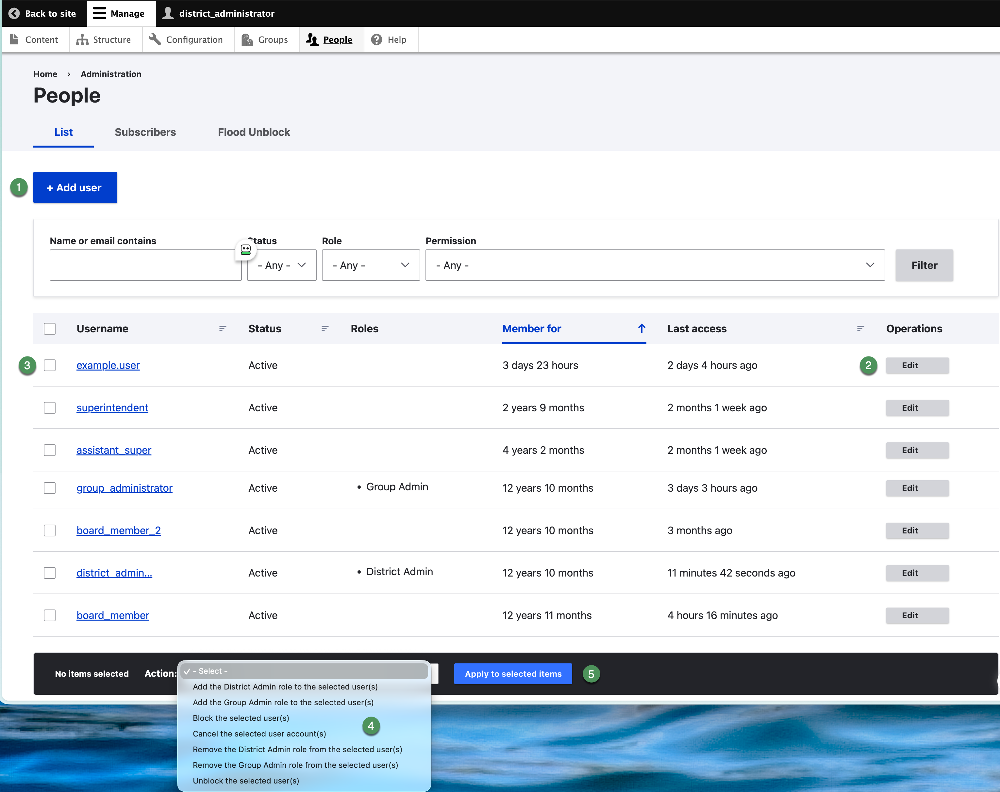

# People and users

The People page displays usernames, status, roles, account age, last access, and available operations.

{ .doc-screenshot }

*Figure SB-DST-004. People list and account controls.*

## Find an account

1. Enter part of the username or email address in **Name or email contains**.
2. Optionally select a **Status**, **Role**, or **Permission** filter.
3. Select **Filter**.
4. Confirm the username, status, roles, and last access before editing.

## Work safely

- Select the username to review an account.
- Select **Edit** in Operations to change one account.
- Select checkboxes only when applying a bulk action.
- Confirm the selected-account count before applying an action.
- Do not cancel accounts until the district approves when cancellation is appropriate.

## Related Topics

- [Add and edit users](user-accounts.md)
- [Roles and access](roles.md)
- [Block and restore access](block-access.md)
