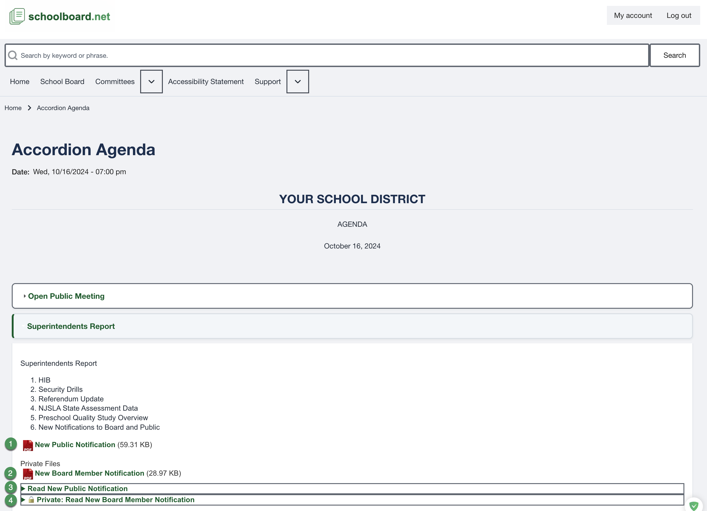

# Review an Accordion Agenda

Accordion headings let you open only the sections you need while keeping your place in a long meeting agenda.

## Open and close sections

1. Select a section heading to expand it.
2. Review the text and supporting materials inside the section.
3. Open a nested heading when an item contains more detail.
4. Select the heading again to collapse it.
5. Use **Expand All** or **Collapse All** when those controls are available.

{ .doc-screenshot }

*Figure SB-BRD-011. Expanded agenda section with four supporting-material callouts.*

## Read the item

Scan the section title first. Then review its lists, tables, recommended action, motion text, and supporting links. Structured HTML content can resize and reflow with browser accessibility tools.

## Keep your place

- Collapse a completed section before moving to the next item.
- Use the browser Back control after opening a linked file when appropriate.
- If a nested item appears missing, expand its parent section first.
- If a heading does not open, focus it with **Tab** and press **Enter** or **Space**.

## Related Topics

- [Public and private materials](materials.md)
- [Search and print](search-and-print.md)

## Revision History

| Version | Date | Status | Summary |
| --- | --- | --- | --- |
| 1.0 | 2026-07-13 | Review Draft | Online Accordion Agenda procedure using consolidated figure SB-BRD-011. |
