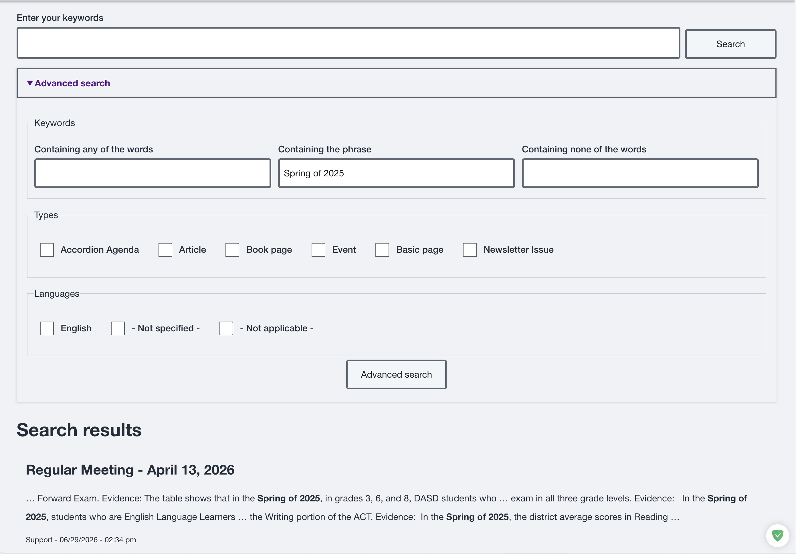
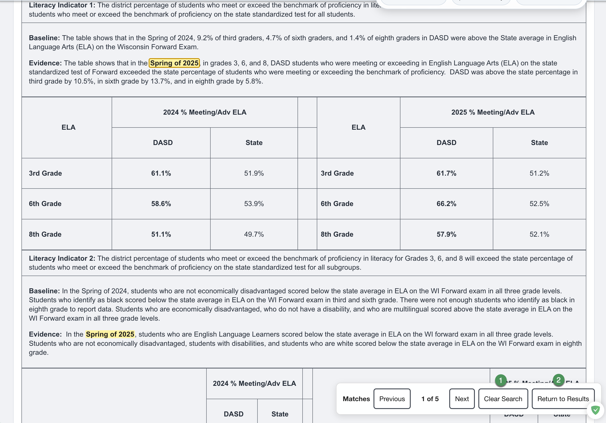
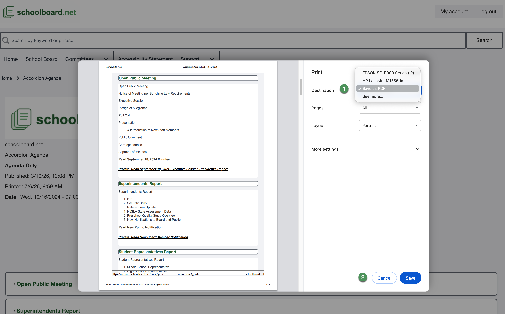

# Search and print

Use site search for content across meetings. Use agenda search to move through matches within a meeting.

## Search the site

1. Enter a distinctive keyword or phrase in **Search by keyword or phrase**.
2. Select **Search**.
3. Open a relevant result.
4. Confirm the meeting date.

{ .doc-screenshot }

*Figure SB-BRD-016. Site search and results.*

## Search within an agenda

1. Enter the term in the meeting search.
2. Submit the search.
3. Review the highlighted match.
4. Use **Previous** and **Next** to move between matches.
5. Select **Clear Search** to remove highlights.
6. Select **Return to Results** to go back.

{ .doc-screenshot }

*Figure SB-BRD-017. Highlighted agenda search match.*

{ .doc-screenshot }

*Figure SB-BRD-018. Clear Search and Return to Results.*

## Print or save

1. Open the correct meeting.
2. Select **Print Full Packet** to include available packet materials, or **Print Agenda Only** for the agenda page.
3. The printable agenda opens in a new browser window.
4. On a computer, review the browser print preview. On an iPad or iPhone, select the browser's **Share** button in the new window, then select **Print**.
5. Confirm the meeting title, date, sections, and page sequence.
6. Print or use the browser's save-as-PDF option when district policy permits.

!!! tip "Printing on an iPad or iPhone"
    **Print Full Packet** and **Print Agenda Only** prepare the agenda in a new window. They do not open the device's print controls. In that new window, select the browser's **Share** button, then select **Print**.

{ .doc-screenshot }

*Figure SB-BRD-019. Meeting print controls.*

{ .doc-screenshot }

*Figure SB-BRD-020. Browser print preview.*

!!! warning
    A printout or saved copy can contain private Board material. Secure or destroy it according to district policy.

## Related Topics

- [Review an agenda](review-an-agenda.md)
- [Public and private materials](materials.md)

## Revision History

| Version | Date | Status | Summary |
| --- | --- | --- | --- |
| 1.0 | 2026-07-13 | Review Draft | Online search and printing procedures aligned with approved controls. |
