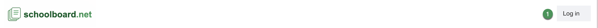
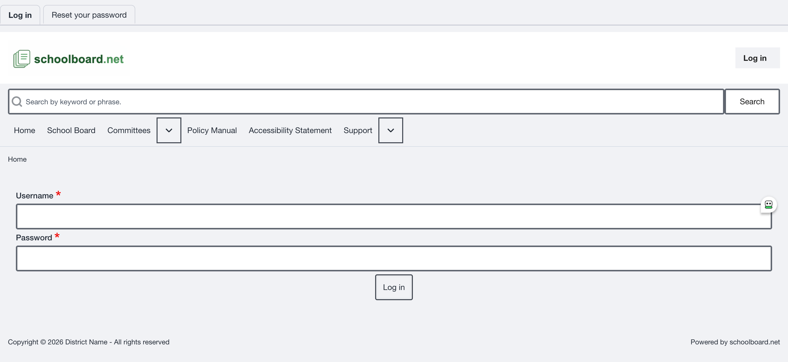
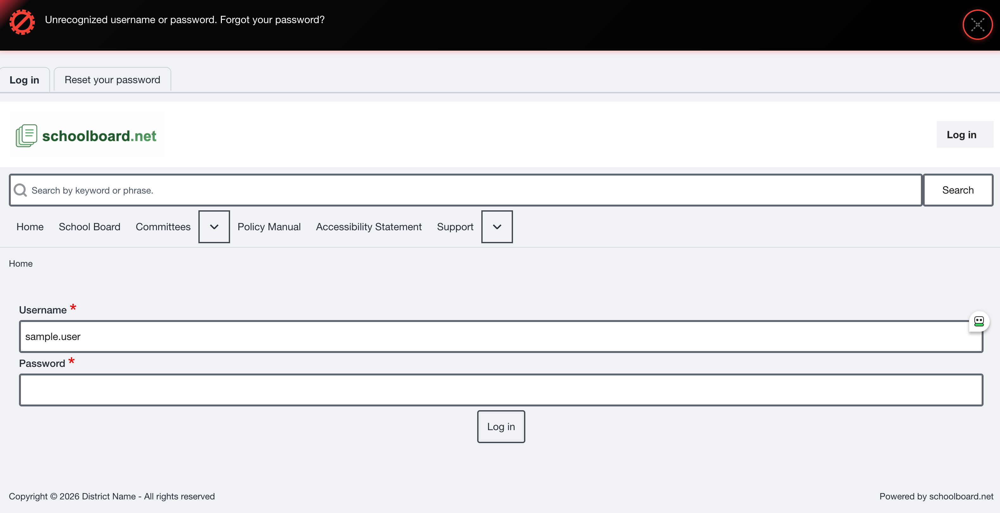
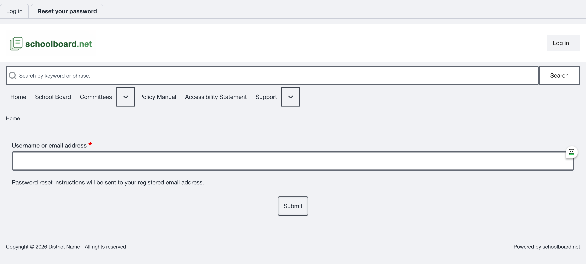
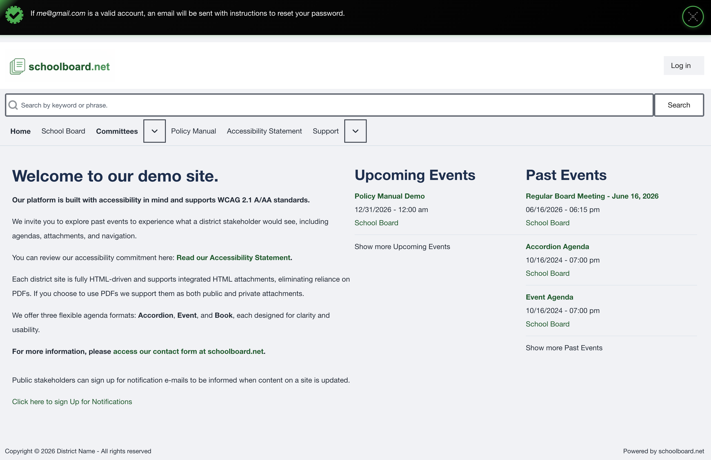

# Sign in and accounts

Sign in with your assigned account to view Board-only materials authorized for you.

## Sign in

1. Open the district's schoolboard.net home page.
2. Select **Log in**.
3. Enter the username or email address supplied by the district.
4. Enter your password.
5. Select **Log in** on the form.
6. Confirm that **My account** and **Log out** are available.

{ .doc-screenshot .narrow }

*Figure SB-BRD-002. Log in control.*

{ .doc-screenshot }

*Figure SB-BRD-003. Board Member login form.*

## If sign-in fails

Check the username or email address, confirm that Caps Lock is off, and re-enter the password. The error message does not reveal which entry was incorrect.

{ .doc-screenshot }

*Figure SB-BRD-004. Generic unsuccessful sign-in message.*

## Reset a forgotten password

1. Select the password-reset link on the login page.
2. Enter the requested username or email address.
3. Submit the request.
4. Check the email account associated with your profile.
5. Use the newest time-limited reset link.
6. Return to the district site and sign in.

{ .doc-screenshot }

*Figure SB-BRD-005. Password reset request.*

{ .doc-screenshot }

*Figure SB-BRD-006. Password reset confirmation.*

## Protect your account

- Use only your assigned account.
- Do not forward password-reset messages or private material links.
- Sign out before leaving a shared computer.
- Store credentials in an approved password manager.

## Related Topics

- [Public and private materials](materials.md)
- [Accessibility and help](accessibility-and-help.md)

## Revision History

| Version | Date | Status | Summary |
| --- | --- | --- | --- |
| 1.0 | 2026-07-13 | Review Draft | Online sign-in and password-reset procedures with approved screenshots. |
